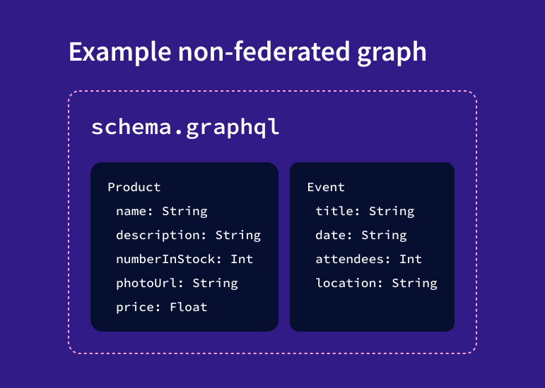
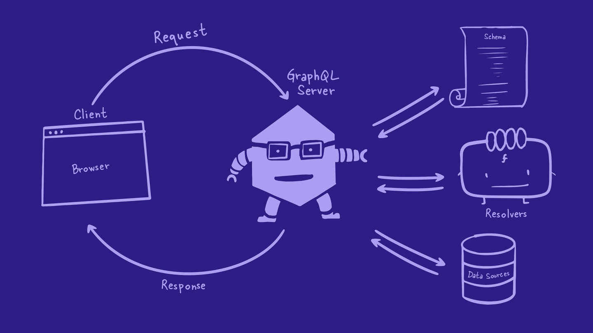
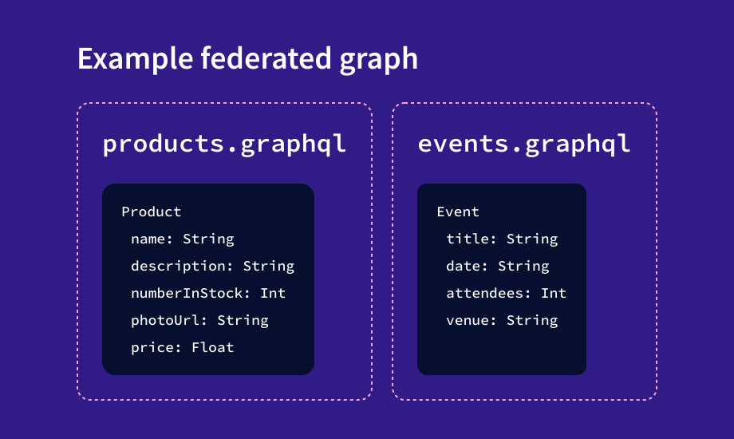
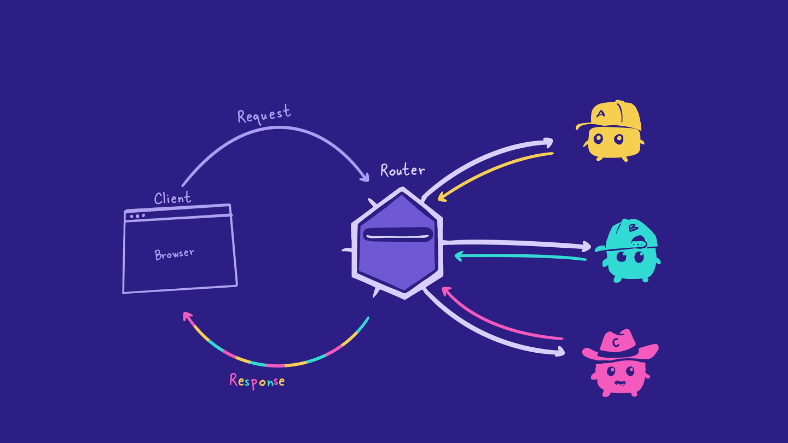
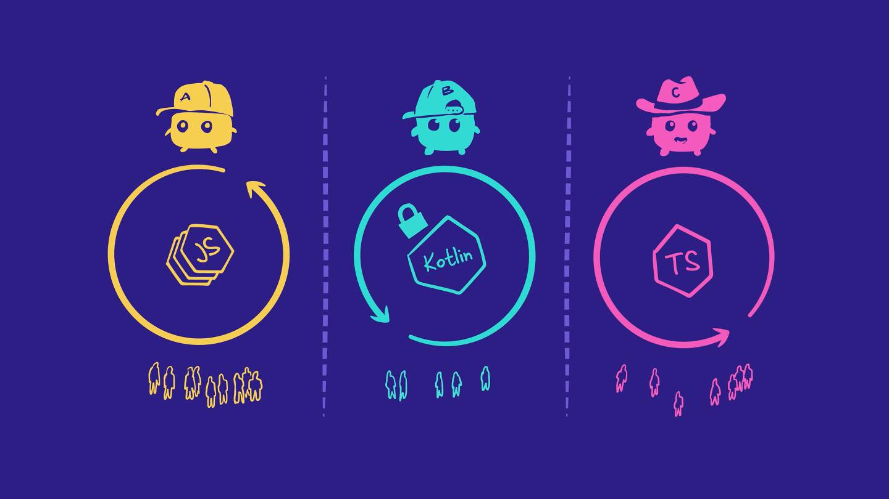

# Chapter 1: Intro to Federation

### Overview

Welcome to Voyage, a 3-part Odyssey series all about building a supergraph with Apollo Federation!

**Apollo Federation** is an architecture for creating modular graphs. That means that your graph is built in smaller pieces that all work together. When your graph is built using this architecture, it's called a supergraph. The supergraph improves the developer experience for teams, making it easier to scale your product.

To help build, manage and scale our supergraph safely, we'll use the Apollo GraphOS platform. We'll work with tools such as GraphOS Studio and the Rover CLI to bring our supergraph to life!

In this first course, we'll dip our toes into the world of federation. We'll explore what Apollo Federation is, why it's useful, and the key pieces of a supergraph architecture. Along the way, we'll put these concepts into practice by building a supergraph for a travel-review app called **FlyBy**.

Ready? Let's get started! In this lesson, we will:

- Specify how a supergraph differs from a non-federated graph
- Identify the key pieces of a supergraph architecture
- Explain the benefits of using a modular supergraph

> **Note**: This series is intended for backend developers.

> If you only work on the frontend, the good news is that your workflow stays the same, regardless of whether or not the backend uses Federation. You'll still send all your GraphQL operations to a single endpoint, and the supergraph will handle the rest!

### Life before Apollo Federation

Before we jump into the details of how to build a supergraph, let's take a step back and look at what life was like without Apollo Federation.

In a non-federated architecture, all the types and fields for your entire graph are represented by a single schema file on a GraphQL server.

When a client needs some data, it sends a GraphQL operation to the server. Then the server uses its schema, resolvers, and data sources to resolve the requested fields, package all the data together, and send it back to the client.

This works fine for smaller projects or teams, but what happens as your schema grows? As more types and fields get added to that one schema file, it becomes harder to manage. Backend teams may face more frequent merge conflicts and slower development time.

But don't worry! That's what Apollo Federation and the supergraph are here to fix.

> **Note**: You might hear the terms "supergraph" and "federated graph" used interchangeably. They mean the same thing: your graph's functionality is divided across smaller, modular graphs.

### The structure of a supergraph

Let's take a closer look at the structure of a supergraph. A supergraph has two key pieces:

- One or more subgraphs
- A router

### Subgraphs

In a supergraph, your schema is built in smaller parts. The division of these parts is usually based on domain or on which team manages that part of the schema.

The example below shows that we could split the schema into two pieces: one piece for fields related to products data (`name`, `numberInStock`, `price`) and another piece for fields related to events data (`date`, `attendees`, `venue`).

Each part of the schema is owned by a separate subgraph. A subgraph is a standalone GraphQL server with its own schema file, resolvers, and data sources.

> **Note**: If you've worked with a microservice architecture before, this might look familiar. You can think of subgraphs as a way to orient the design of your graph's schema around your microservice architecture.

### The router

A supergraph architecture also includes the router, which sits between clients and the subgraphs. The router is responsible for accepting incoming operations from clients and splitting them into smaller operations that can each be resolved by a single subgraph.

The router does this work with the help of the supergraph schema. The supergraph schema is composed of all the fields and types from each subgraph schema. (Later in the course, we'll dive deeper into composition and how the router resolves client requests.)

The supergraph schema is a bit like a map, helping the router determine which subgraph can resolve each field in an operation.

### Why use Apollo Federation?

With a supergraph architecture, nothing changes from the client perspective. They still communicate with a single GraphQL endpoint (the router), and they don't need to know a thing about how the graph is built under the hood.

The real benefits are on the backend. These benefits come from one of the core principles of Apollo Federation: the **separation of concerns**.

By splitting up our schema into subgraphs, backend teams can work on their own subgraphs independently, without impacting developers working on other subgraphs. And since each subgraph is a separate server, teams have the flexibility to choose the language, infrastructure, and policies that work best for them.

[Next: Chapter 2](Voyage-part-1-chapter-2.md)
