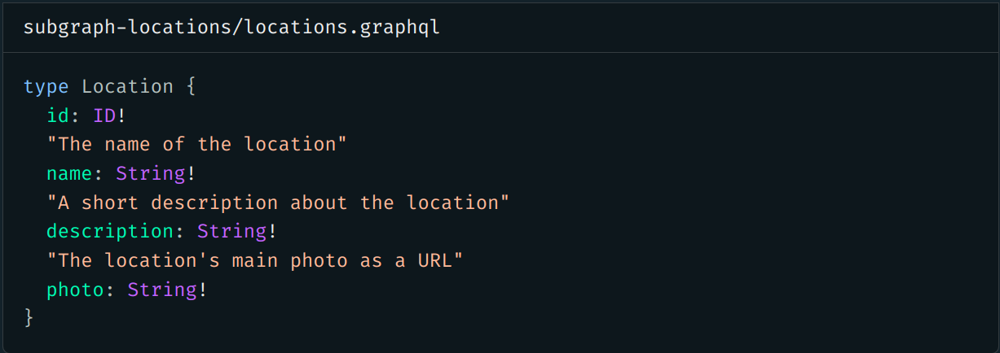
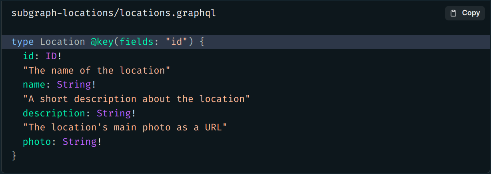
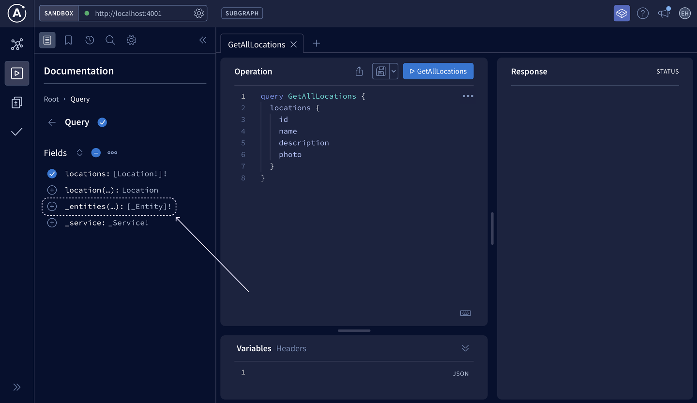
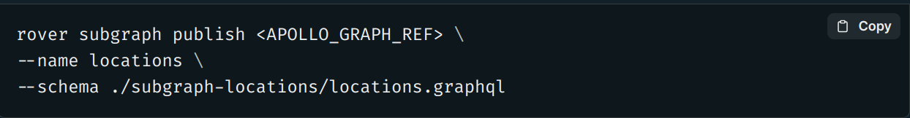
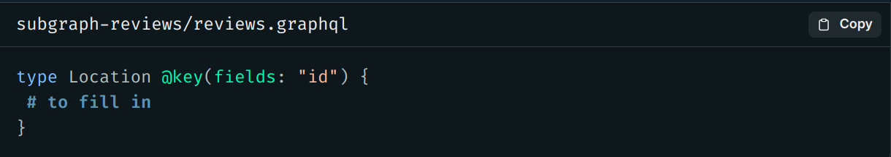
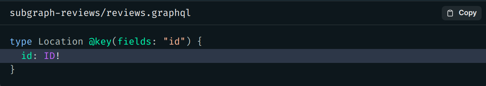
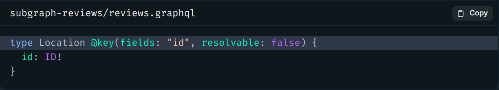
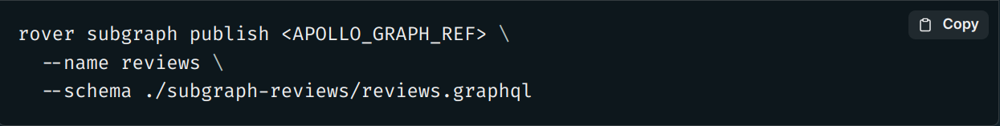

# Chapter 10: Defining an Entity

[Previous: Chapter 9](Voyage-part-1-chapter-9.md) | [Next: Chapter 11](Voyage-part-1-chapter-11.md)

### Overview

Let's jump into the code!

In this lesson, we will:

- Convert the Location type into an entity that can be shared between our subgraphs
- Publish updates to existing subgraphs

# ✏️ Defining the `Location` entity's `@key`

1.Open up the `subgraph-locations/locations.graphql` file and find the `Location` type.

2. We'll add the `@key` directive to this type definition, specifying the `fields` property and setting its value to `id`.

## Check changes in Sandbox

Let's test our changes. Open up http://localhost:4001 in your browser and use Sandbox to query our server again.

In the Documentation tab, we should now see that there's a new field on the Query type called `_entities`. This is a special field that the router uses for coordinating data between subgraphs. We'll learn how exactly the router uses this field in the next lesson.

Other than that, not much has changed! We should still be able to use Explorer to query the `locations` subgraph as before. (Try running a quick query for some data on the `locations` field, to make sure everything still works as expected.)

### Publish the `locations` subgraph

We'll need to publish this subgraph so that the schema registry can pick up our changes.

Let's make sure we're in the top-level directory of our project when we run the `rover subgraph publish` command in the terminal.

We can omit the `--routing-url` option in the command because we already set that value the first time we published the subgraph to the registry.

Great, it looks like our changes have been published successfully!

# ✏️ Defining our entity in `reviews`

We want to use the `Location` entity in our `reviews` subgraph as well.

1. Open up the `subgraph-reviews/reviews.graphql` file.
2. We'll add the Location type definition, along with the @key directive and set the id field as the primary key.

3. Inside the curly braces, we'll add the id field of type non-nullable ID!.

The `Location` entity doesn't need to include all the fields we defined for it in the `locations` subgraph. After all, the `reviews` subgraph doesn't know anything about these fields, or how to resolve them!

So far, we've given our `reviews` subgraph a stub of the `Location` entity. A stub serves as a basic representation of a type that includes just enough information to work with that type in the subgraph.

There's one more change we need to make. Because the `reviews` subgraph is not responsible for resolving any of the entity's other fields, we'll add one more property to our `@key` directive.

4. Inside the `@key` directive, add a property called `resolvable` and set it to `false`.

This property tells the router that this subgraph doesn't define a reference resolver for this entity.

Recall that a reference resolver is responsible for returning all of the entity fields that this subgraph contributes. The `reviews` subgraph doesn't contribute any other fields (besides the key field), so it doesn't need to define a reference resolver. The `resolvable: false` property indicates this to the router!

### Publish the `reviews` subgraph

Now let's publish our `reviews` subgraph updates. From a terminal in the root directory of our project, let's run the `rover subgraph publish` command again.

Alright, we see a success message and our changes have made it to the registry!

### Key takeaways

- To create an entity, we can use the @key directive to specify which field(s) can uniquely identify an object of that type.
- When a subgraph can't be used to resolve any non-@key fields of an entity, we pass resolvable: false to the @key directive definition.

[Previous: Chapter 9](Voyage-part-1-chapter-9.md) | [Next: Chapter 11](Voyage-part-1-chapter-11.md)
