# Chapter 11: Entities and the Query Plan

[Previous: Chapter 10](Voyage-part-1-chapter-10.md) | [Next: Chapter 12](Voyage-part-1-chapter-12.md)

### Overview

We've set up our entity definitions, but how exactly does the router use these entities?

In this lesson, we will:

- Learn how the router uses entities and the query plan to connect data from multiple subgraphs
- Learn how entity representations and reference resolvers work together

### Let's look at an example query

Let's say the client makes a request for our app's latest reviews. In their query, they'll request the id, comment, and rating for each review, along with the name of each review's location.

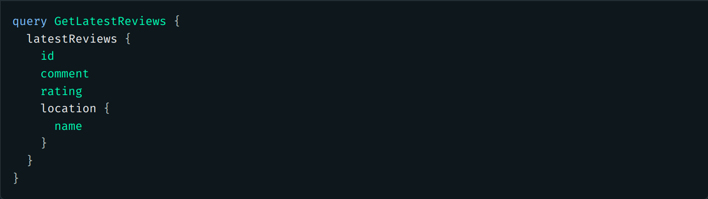
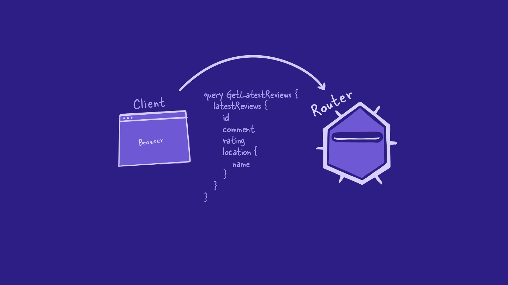
Now it's the router's time to shine!

### Step 1: Building the query plan

Like we saw earlier, the router begins by building a query plan that indicates which requests to send to which subgraphs.

The router starts with the incoming query's top-level field, `latestReviews`. With the help of the supergraph schema, the router sees that `latestReviews` is defined in the `reviews` subgraph.

So the router starts the query plan with a request to the `reviews` subgraph.

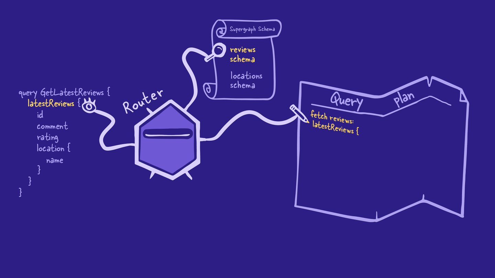

The router continues like this for a while, checking each field in the query against the supergraph schema, and adding it to the query plan. The fields for `id`, `comment`, `rating` and `location` all belong to the `reviews` subgraph.

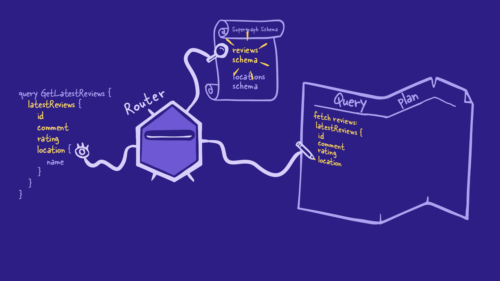

But when the router reaches the `name` field for a particular `Location`, it sees from the supergraph schema that `Location.name` can only be resolved by the `locations` subgraph (because that's where the `Location.name` field is defined).

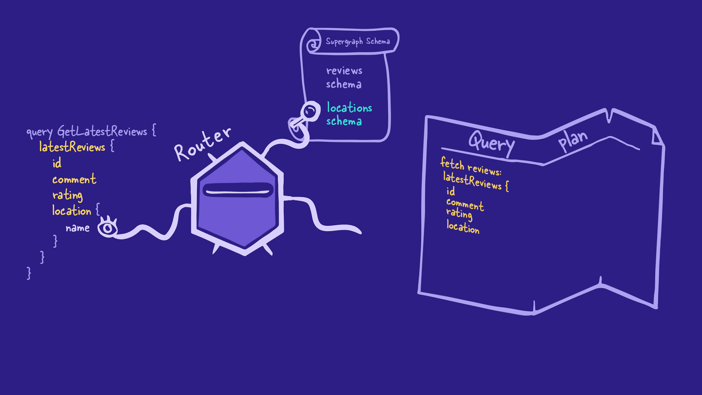

That means the router is going to have to connect data between subgraphs.

To do this, the router needs some more information from the `reviews` subgraph: the entity representation for each review's corresponding `Location` object.

Remember that entity representations are what the router uses to track a specific object between subgraphs. To make an entity representation for a `Location` object, the router needs the location's typename and its primary key (which in this case is the `id` field).

The router can get both these fields from the `reviews` subgraph.

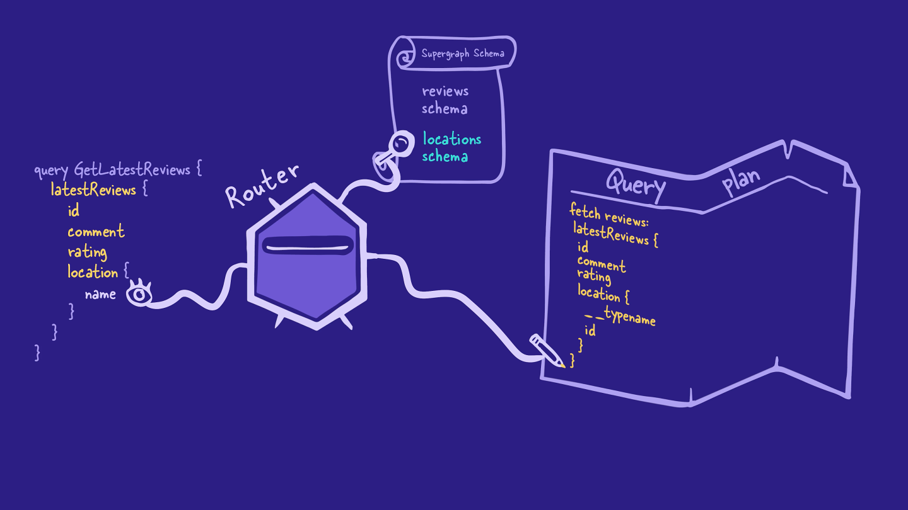

From there, the router adds another operation to its query plan to request the location's `name` from the `locations` subgraph.

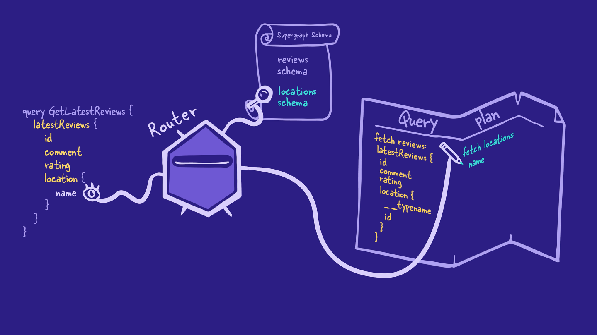

With that, all the fields in the query have been accounted for in the query plan. It's time to move on to the next step: executing the plan.

# Step 2: Querying the `reviews` subgraph

The router begins by requesting data from the `reviews` subgraph.

The `reviews` subgraph resolves all the requested fields as it normally would, including the entity representations for all the requested location objects.

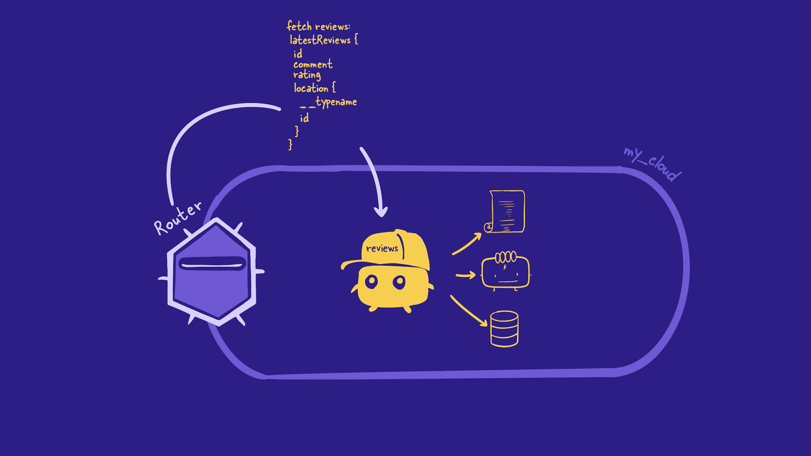

This subgraph doesn't know that the router plans to do anything special with the location's id or typename. It just sends back the data to the router like it was asked.

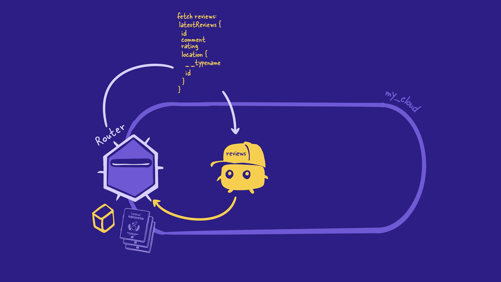

With that, the router's taken care of the first part of the query plan! The next step is to retrieve the `name` field from the `locations` subgraph.

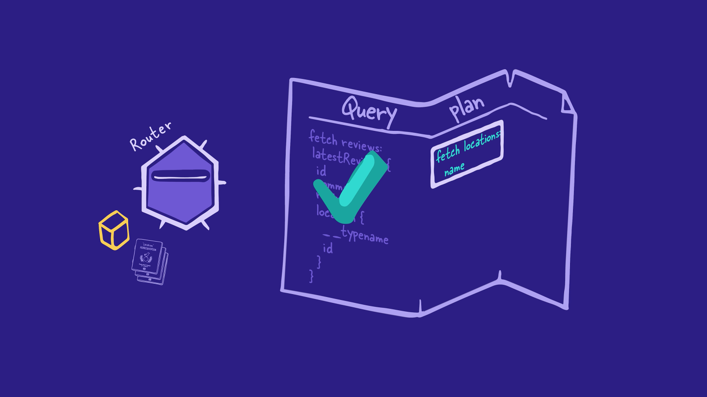

# Step 3: Querying the `locations` subgraph

Remember the `_entities` field that showed up in our subgraph after we first defined an entity? This is where it comes back into the story!

The router builds a request using the `_entities` field.

This field takes in an argument called `representations`, which takes in, well, a list of entity representations! This is where the entity representations that the router received from the `reviews` subgraph will go.

In the same request, the router adds the rest of the fields left in the query plan (in this case, the location's `name`).

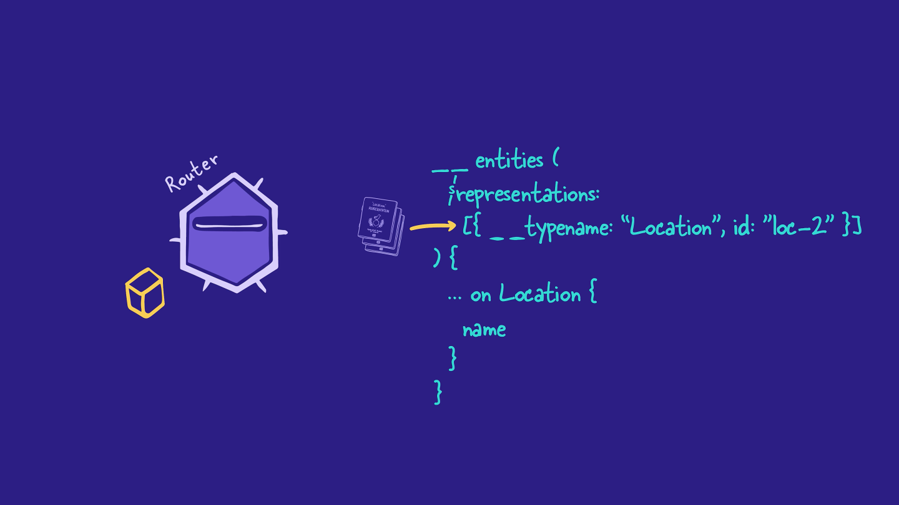

The router sends this request to the location's subgraph.

To resolve the `_entities` field, the `locations` subgraph uses its reference resolver. Remember this is a special resolver function used to return all the entity fields that this subgraph contributes.

The `locations` subgraph looks at the `__typename` value of each reference object to determine which entity's reference resolver to use. In this case, because typename is "Location", the `locations` subgraph knows to use the `Location` entity's reference resolver.

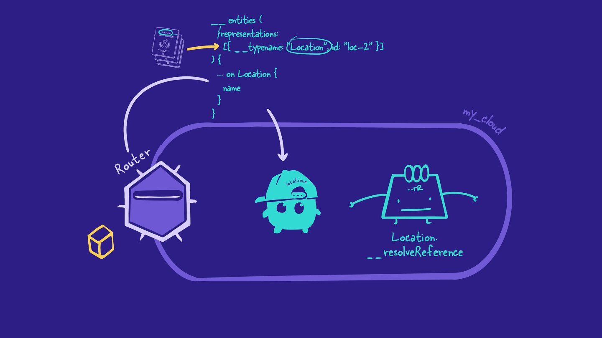

The `Location` reference resolver runs once for each entity representation in the query. Each time, it uses the entity representation's primary key to return the corresponding `Location` object.

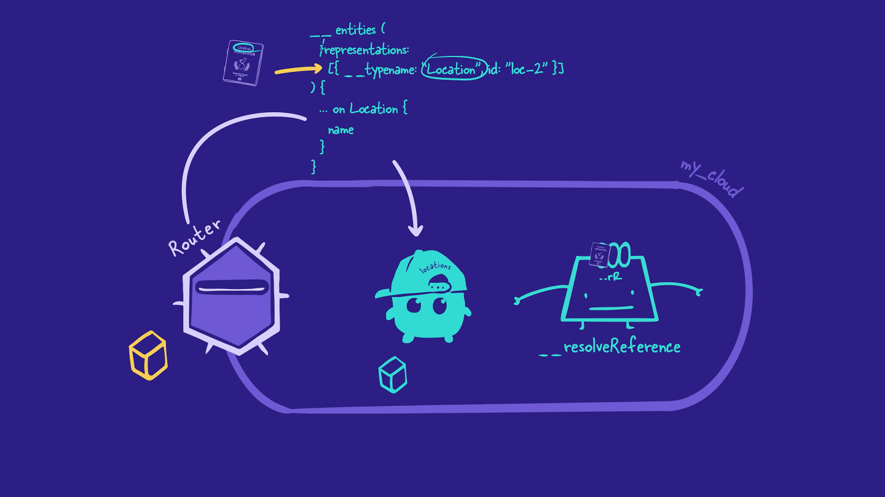

After the `locations` subgraph finishes resolving the request, it sends the data back to the router.

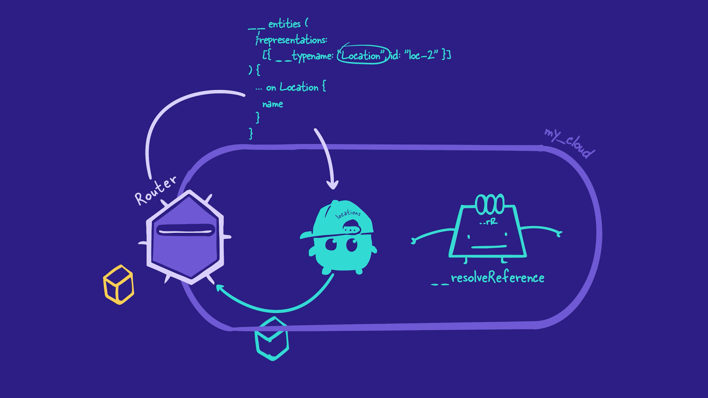

That's it for the executing phase!

# Step 4: Sending the final response to the client

Now, the router combines all the data it received from the `reviews` and `locations` subgraphs into a single JSON object. And at last, the router sends the final object back to the client.

### Key takeaways

- When the router needs to query for fields from a different subgraph, it also asks for entity representations from the current subgraph it's querying. These representations will be used in the subsequent operation's \_entities field, set as the value for the representations argument.
- The reference resolver takes each representation and returns the matching data for its requested fields.

[Previous: Chapter 10](Voyage-part-1-chapter-10.md) | [Next: Chapter 12](Voyage-part-1-chapter-12.md)
