# Chapter 12: Referencing an Entity

[Previous: Chapter 11](Voyage-part-1-chapter-11.md) | [Next: Chapter 13](Voyage-part-1-chapter-13.md)

### Overview

Let's get back to our problem of how to connect data between subgraphs. We'll take care of one of the missing pieces of our schema: the `Review.location` field.

In this lesson, we will:

Learn how to reference an entity in a subgraph as a return type by implementing the `Review.location` field


# The `Location` entity as a return type

We want to use the `Location` entity as the return type for the `Review.location` field, so let's take a closer look at how to do that.

### ✏️ Adding the `Review.location` field to the schema

1. Open up the `subgraph-reviews/reviews.graphql` file.

2. Let's add a new field called `location`, which should return a `Location` type.

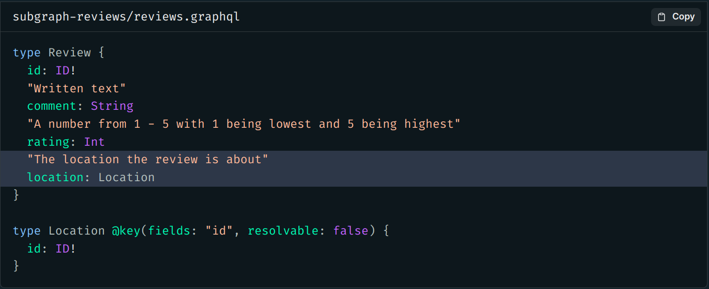

3. We can test our changes and open Sandbox for the `reviews` subgraph at http://localhost:4002. We should see the new `location` field show up under `latestReviews`.


4. Let's try running a query to test out our new field. We'll query for `latestReviews`, and include the `id`, `comment` and `rating` fields. Next, we'll include the new `location` field and its `id`. Let's also give the operation a descriptive name: `GetLatestReviewsAndLocations`.


When we submit the query, we can see that we get back `null` for the value of each `location`!

```json {
  "data": {
    "latestReviews": [
      {
        "id": "rev-8",
        "comment": "This is simply unbelievable! It's the perfect solution for our business. Really good. I don't always clop, but when I do, it's because of planet",
        "rating": 5,
        "location": null
      },
      {
        "id": "rev-9",
        "comment": "Planet is exactly what our business has been lacking. It's incredible. If you want real marketing that works and effective implementation - planet's got you covered.",
        "rating": 5,
        "location": null
      },
      {
        "id": "rev-10",
        "comment": "Thanks planet! I was amazed at the quality of planet. Planet did exactly what you said it does.",
        "rating": 5,
        "location": null
      }
    ]
  }
}
```

This is because we haven't defined what the `reviews` subgraph should return when this field is queried! We first need to define a corresponding resolver function.

### ✏️ The `Review.location` resolver function

As we saw before, the router will ask the `reviews` subgraph for an entity representation of the location the review is associated with. The router already knows how to retrieve the typename, but it needs the location's id key field. Let's set that up.

1. Open up the `subgraph-reviews/resolvers.js` file.

2. In the `resolvers` object, we'll add a new key for the `Review` type, and an empty resolver function for the `location` field.

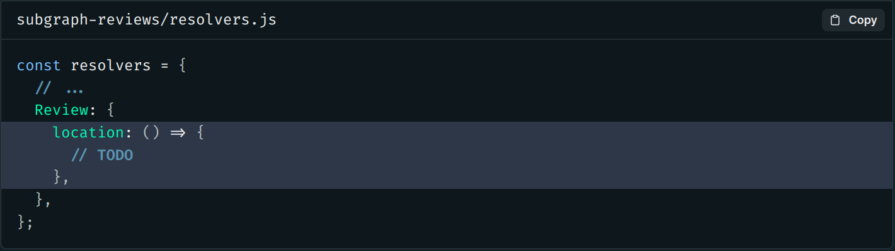

3. Name the first parameter of the resolver function `review`, which is the `parent` object of the field.

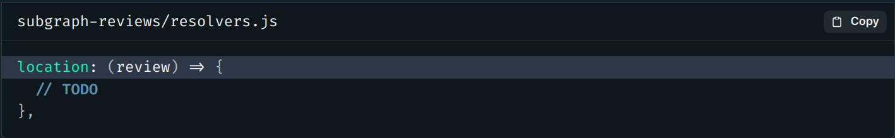

4. For the body of the resolver, we need to return an entity representation with the location's id. So how do we retrieve the id of a location for a particular review?

To answer this question, we'll take a quick detour to look at what reviews data we get back from our data source. Jump over to the `reviews_data.json` file in the `datasources` directory. Here we can see that for each review object, we are storing the `locationId` each review belongs to.

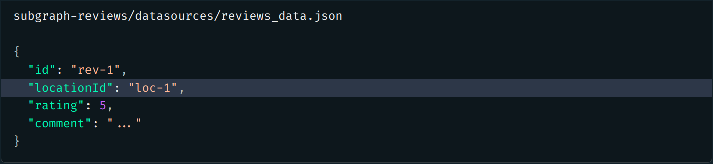

This `locationId` field specifies exactly the data we're looking for - a location's `id`!

Back in the `Reviews.location` resolver, let's destructure the `review` object and pull out `locationId`. Then we'll return a new object that reassigns `locationId` to `id`. This will match it to the name of the `Location` entity's `@key` field.

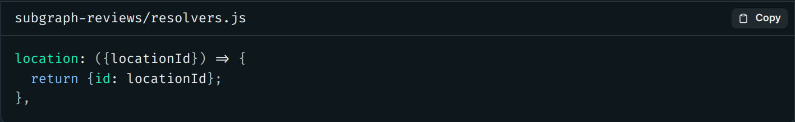

### Checking your work

Fantastic! Now let's check that everything's playing nicely. Go back to Apollo Sandbox for the `reviews` subgraph at http://localhost:4002.

Let's try out that query again. This time, we get back each location's id!

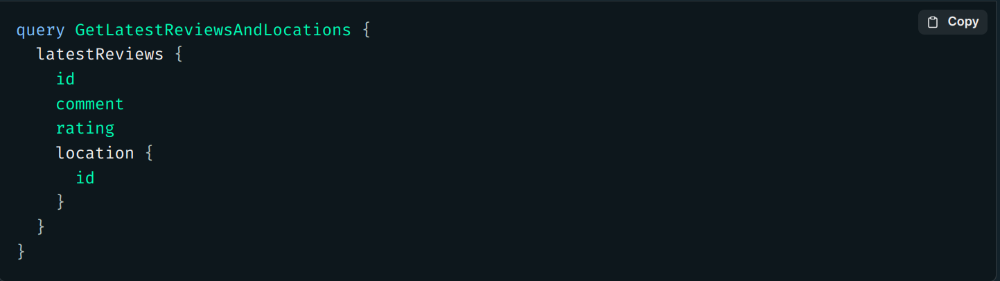

The response should match the shape of the object below:

```json
{
  "data": {
    "latestReviews": [
      {
        "id": "rev-8",
        "comment": "This is simply unbelievable! It's the perfect solution for our business. Really good. I don't always clop, but when I do, it's because of planet",
        "rating": 5,
        "location": {
          "id": "loc-2"
        }
      },
      {
        "id": "rev-9",
        "comment": "Planet is exactly what our business has been lacking. It's incredible. If you want real marketing that works and effective implementation - planet's got you covered.",
        "rating": 5,
        "location": {
          "id": "loc-3"
        }
      },
      {
        "id": "rev-10",
        "comment": "Thanks planet! I was amazed at the quality of planet. Planet did exactly what you said it does.",
        "rating": 5,
        "location": {
          "id": "loc-4"
        }
      }
    ]
  }
}
```

And now our `reviews` subgraph can resolve a location's `id` field, which is exactly what the router will need to associate data across subgraphs.

To resolve the rest of the `Location` fields (like `name`, `description`, or `photo`), we still have one thing left to add to our schema: the `Location` entity's reference resolver!

### ✏️ Implement the `__resolveReference` resolver

1. Moving over to the `subgraph-locations` directory, open up the `resolvers.js` file.

2. Inside the `resolvers` object, add a new key for `Location`, then a resolver function called `__resolveReference`.

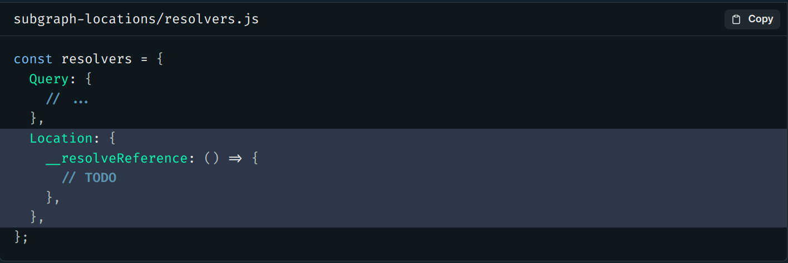

3. Next, let's set up this function's arguments.

Destructure the first argument, which is the entity representation object, and pull out the `id` field from it.

Similarly, destructure the second argument (`context`) to access the `dataSources` property.

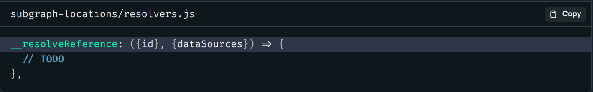

4. The body of the reference resolver function needs to return all the entity fields that this subgraph defines. To do this, we'll use the `LocationsAPI` data source and its `getLocation` method. It returns a `Location` object for a given ID.

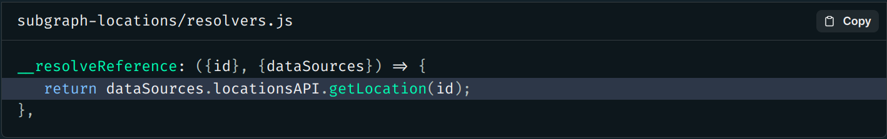

> Note: You can check out how the `getLocation` method works by peeking inside the `subgraph-locations/datasources/LocationsApi.js` file.

See it in action!

Now that our `__resolveReference` resolver is set up, we can test it out by pretending to be the router and mimicking the request it sends to the `locations` subgraph!

> Note: You aren't required to do this step, as it's a bit advanced. But if you're interested in seeing how things work under the hood, then proceed!

With our `locations` server running, open http://localhost:4001 in Apollo Sandbox.

Add the following query variable in the Variables pane, to imitate the reference objects the router would pass in from the `reviews` subgraph:

```json
{
  "representations": [
    {
      "__typename": "Location",
      "id": "loc-1"
    },
    {
      "__typename": "Location",
      "id": "loc-2"
    }
  ]
}
```

Then run the following query:

```graphql
query GetLocationNames($representations: [_Any!]!) {
  _entities(representations: $representations) {
    ... on Location {
      name
    }
  }
}
```

The response should look something like the object below.

```json
{
  "data": {
    "_entities": [
      {
        "name": "The Living Ocean of New Lemuria"
      },
      {
        "name": "Vinci"
      }
    ]
  }
}
```

> Note: As you can see, the `Query._entities` field is quite powerful and can be used for malicious reasons (anyone can mimic a request and retrieve information they aren't supposed to). For this reason, your subgraphs should not be directly accessible by clients. See the docs for more information. https://www.apollographql.com/docs/apollo-server/using-federation/apollo-subgraph-setup/#securing-your-subgraphs

And with that, our graph is now fully set up to handle referencing entities!

Okay, we should be ready to query our supergraph in Studio, and watch the magic of the router associating data between our subgraphs!

Let's get to building the `GetLatestReviews` query we agreed upon earlier with the frontend team. We'll add our fields... wait a minute, where did our `location` field go? Wasn't this working great locally on Sandbox? What happened?

We forgot to publish our `reviews` subgraph schema changes to the registry!

### ✏️ Publish subgraph change with Rover

Oops! Let's hop over to a terminal in the root of the project, and run `rover subgraph publish`, passing in the variables for the `reviews` subgraph.

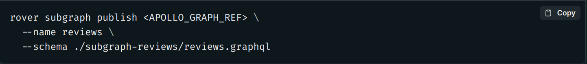

Now we should be ready to query our supergraph in Studio, and watch the magic of the router associating data between our subgraphs! ✨

### ✏️ Check your work against the router

Let's run this query in Studio.

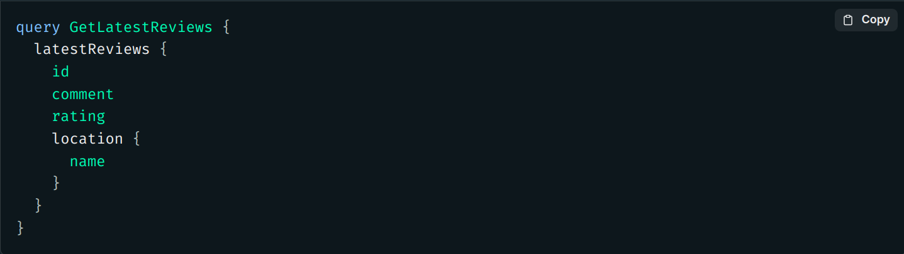

Note: If you see red squiggly lines below the `location` field on `latestReviews`, try refreshing the page. You may have been faster than the supergraph composition!

And we can see all our data is coming back from both the `locations` and `reviews` subgraphs!

We should see a response like this:

```json
{
  "data": {
    "latestReviews": [
      {
        "id": "rev-8",
        "comment": "This is simply unbelievable! It's the perfect solution for our business. Really good. I don't always clop, but when I do, it's because of planet",
        "rating": 5,
        "location": {
          "name": "Vinci"
        }
      },
      {
        "id": "rev-9",
        "comment": "Planet is exactly what our business has been lacking. It's incredible. If you want real marketing that works and effective implementation - planet's got you covered.",
        "rating": 5,
        "location": {
          "name": "Asteroid B-612"
        }
      },
      {
        "id": "rev-10",
        "comment": "Thanks planet! I was amazed at the quality of planet. Planet did exactly what you said it does.",
        "rating": 5,
        "location": {
          "name": "Krypton"
        }
      }
    ]
  }
}
```

Let's update our schema agreement checklist and check off the location field we just added to the Review type.

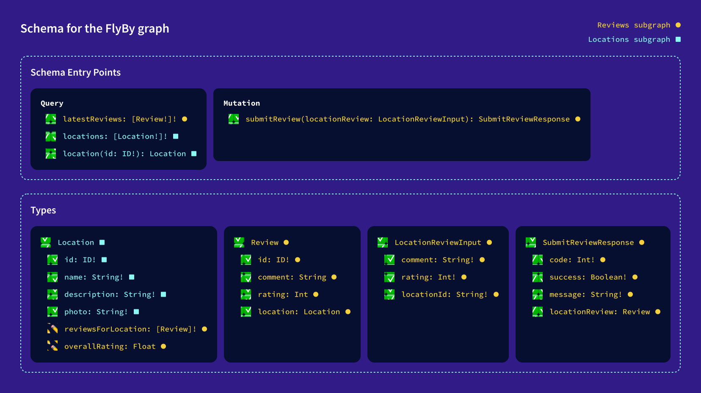

### Key takeaways

- We can reference an entity in one subgraph as the return value for a type's field.
- Any subgraph that contributes fields to an entity needs to define a `__resolveReference` resolver function for that entity. This resolver is called when the router needs to resolve references to that entity made from within other subgraphs.

[Previous: Chapter 11](Voyage-part-1-chapter-11.md) | [Next: Chapter 13](Voyage-part-1-chapter-13.md)
