# Chapter 13: Contributing to an Entity

[Previous: Chapter 12](Voyage-part-1-chapter-12.md) | [Next: Chapter 14](Voyage-part-1-chapter-14.md)

### Overview

In the previous lesson, we just saw how subgraphs can reference an entity as a field's return type. Now, let's take a look at how subgraphs can contribute fields to an entity.

In this lesson, we will:

- Learn how multiple subgraphs can contribute fields to an entity
- Update the `Location` entity in our `reviews` subgraph schema by contributing the `reviewsForLocation` and `overallRating` fields


# ✏️ Contributing fields

Remembering our FlyBy UI, we know it needs to fetch each location's `overallRating`, along with a list of its `reviewsForLocation`:

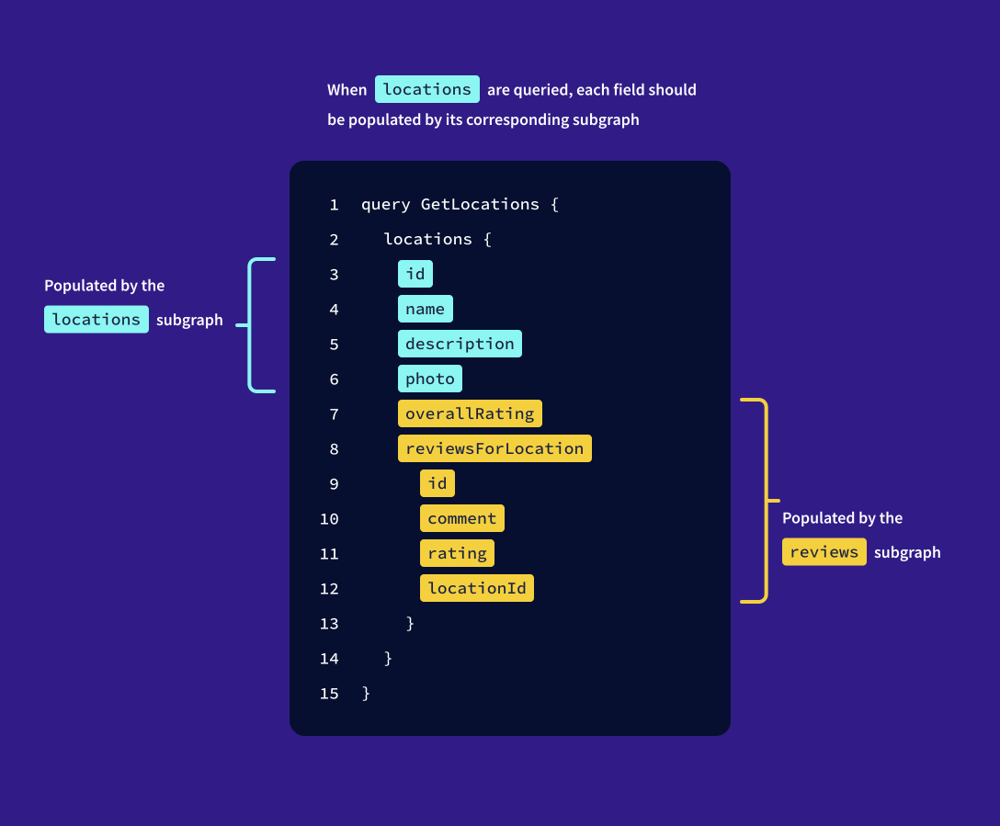

By following the separation of concerns principle, it makes sense that any data about ratings or `reviews` is populated by the reviews subgraph, so let's head on over there and make those additions!

1. Open up the `subgraph-reviews/reviews.graphql` file.

2. Find the `Location` entity definition in the schema. We previously defined this as a stub of the `Location` type.

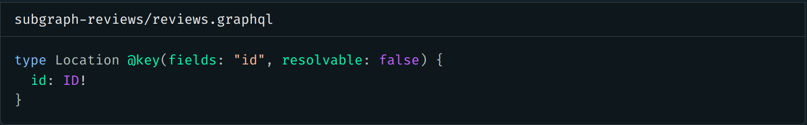

By default, a subgraph should only contribute fields that aren't defined by other subgraphs, with the exception of the primary key field. This means that because the `locations` subgraph defines `name`, `description`, and `photo` as fields for the `Location` type, we won't - and shouldn't - define those fields here in the `reviews` subgraph!

> Note: You can override the default behavior explained above to allow multiple subgraphs to resolve the same field https://www.apollographql.com/docs/federation/entities/define-advanced-keys/#resolving-another-subgraphs-field by applying either the `@shareable` or `@provides` directive. This is an optional performance optimization that can instruct the router on how to plan the execution of a query across as few subgraphs as possible.

Because we now want the `reviews` subgraph to contribute new fields to the `Location` definition, the first thing we need to do is remove the `resolvable: false` property from the `@key` directive. This will enable our `reviews` subgraph to define and resolve its own `Location` fields.

3. Remove the `resolvable: false` property from the `Location` type's `@key` directive.

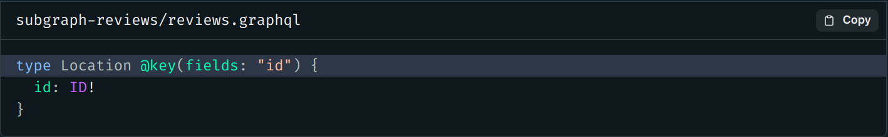

### ✏️ Adding new fields to the `Location` entity

Now we're ready to add the two new fields.

- the `overallRating` field, which returns a `Float`
- the `reviewsForLocation` field, which returns a non-null list of `Review` objects.

  We'll also add descriptions to these fields so we can quickly see what they represent.

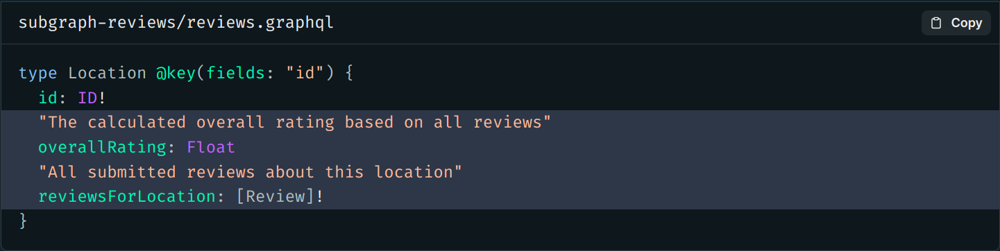

### ✏️ Adding resolvers

Each of these fields needs a resolver function to return data, so let's take care of that next.

1. Open the `resolvers.js` file in the `subgraph-reviews` directory.

2. Add a `Location` entry to the `resolvers` map. We'll also add two empty resolver functions for the `overallRating` and `reviewsForLocation` fields.

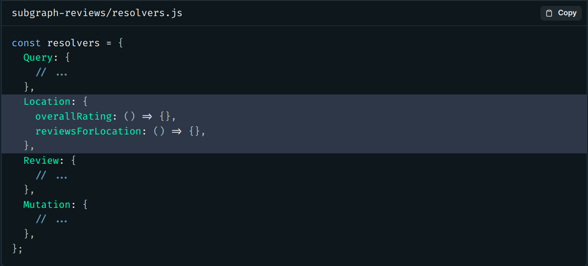

3. We'll start with the `overallRating` resolver. First, we'll destructure the `parent` argument (a `Location` object) to get the `id` field. We'll also destructure the `contextValue` argument to pull out our `dataSources`.

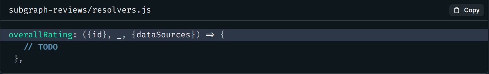

Refresher: Resolver arguments

> Resolver functions have a specific signature with four optional parameters: `parent`, `args`, `contextValue`, and `info`.

- parent:
  `parent` is the returned value of the resolver for this field's parent.
- args:
  `args` is an object that contains all GraphQL arguments that were provided for the field by the GraphQL operation.
- contextValue:
  `contextValue` is an object shared across all resolvers that are executing for a particular operation.
- info:
  `info` contains information about the operation's execution state, including the field name, the path to the field from the root, and more.
  You can learn more about resolver parameters in action by checking out our Odyssey Lift-Off II course! https://www.apollographql.com/tutorials/lift-off-part2

4. Inside the function, we'll return the results of calling our `dataSources` object, its `ReviewsAPI`, and its `getOverallRatingForLocation` method. Then, pass in the `id` of the location that we're querying.


> Note: You can check out how the `getOverallRatingForLocation` method works by peeking inside the `subgraph-reviews/datasources/ReviewsApi.js` file.

5. Next, we'll set up the resolver function for the `reviewsForLocation` field and follow the same structure as before. This time, we'll use the `getReviewsForLocation` method of the `ReviewsAPI` to fetch all reviews for a location based on its id.

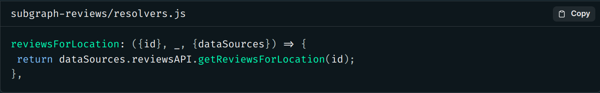

Wonderful! Our resolvers receive a location's id and can return the right data for that location.

Adding a `__resolveReference` function
Earlier, we learned that each subgraph that contributes fields to an entity needs to define a reference resolver for that entity.

We already defined the reference resolver in the `locations` subgraph, but the `reviews` subgraph also needs some way of knowing which particular location object it's resolving fields for.

Here's the good news: because we're using Apollo Server, defining the reference resolver function explicitly in the reviews subgraph is not a requirement. Apollo Server defines a default reference resolver for any entities we don't define one for.

This diagram shows how the `__resolveReference` function works by default with a query for a particular `Location`.

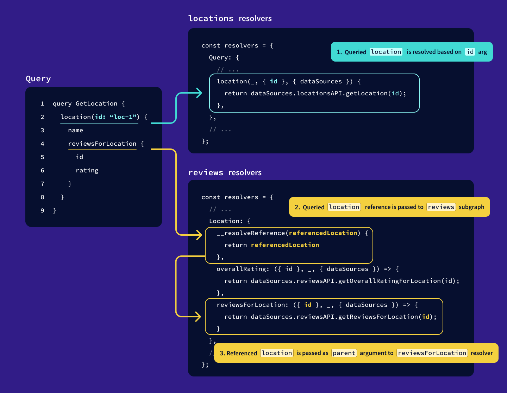

1. A queried `location` is resolved in the `locations` subgraph based on its `id` argument.
2. When the server reaches the `reviewsForLocation` field, the router knows that this is the responsibility of the `reviews` subgraph. The `__resolveReference` function receives the queried `Location` object that the `locations` subgraph returned.
3. The `reviewsForLocation` resolver receives the referenced `Location` object as its `parent` argument, which it can then destructure and use to resolve data.

Even with this feature working for us under the hood, we'll walk through the steps to add this function ourselves in the optional section below, and review what happens when our router associates data across subgraphs.

### Learn more: Adding a reference resolver

Let's use the query below as an example of how the reference resolver function comes into play. We'll walk through the steps the router will follow to build a query plan, and execute this query.

```graphql
query GetLocationReviewData {
  locations {
    name
    overallRating
    reviewsForLocation {
      comment
    }
  }
}
```

###Adding the reference resolver

Open up the `subgraph-reviews/resolvers.js` file and add a new function called `__resolveReference`.

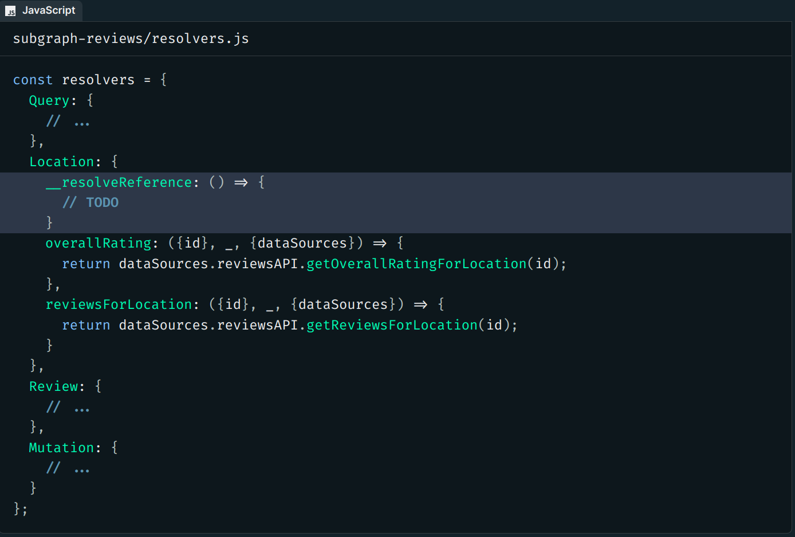

This function is where our `reviews` subgraph will receive an entity representation passed by any other subgraph referencing the `Location` entity.

### The Query Plan

The query starts with the `locations` entry point into our schema, which is defined in the `locations` subgraph. The router will start with a request to this subgraph.

The router encounters the `name` field, and checks this against the supergraph schema. This field is added to the query plan as resolvable from the `locations` subgraph.

On the next line, the router encounters the `overallRating` field. From the supergraph schema, the router sees that this field can only be resolved by the `reviews` subgraph.

The router adds a new operation to the query plan, this time requesting the `overallRating` for each location from the `reviews` subgraph.

The next field, `reviewsForLocation`, along with its subfield, `comment`, are likewise added to the request to the `reviews` subgraph.

To query the `reviews` subgraph, the router asks the `locations` subgraph for some extra information about the `locations` field: each location's `__typename` and `id`, which make up the location's entity representation.

### Executing the query plan

The router begins carrying out the query plan outlined above, starting with asking the `locations` subgraph for data, including the representations for each of the objects in the queried `locations`.

The `locations` subgraph resolves all of the fields requested from it as it normally would, and returns the representations for each of the locations.

The router uses the `_entities` field to build a request for the `reviews` subgraph, which takes in the locations representations as an argument. The router also specifies the fields it needs from the `reviews` subgraph.

The `__resolveReference` function defined for the `Location` entity in the `reviews` subgraph is called with each representation object, which contains the `__typename` and `id` properties.

Because the `__typename` property will identify each representation as type `Location`, we can return this reference exactly as it is, and the `overallRating` and `reviewsForLocation` resolvers will receive the passed `id` in their `parent` argument when they are queried.

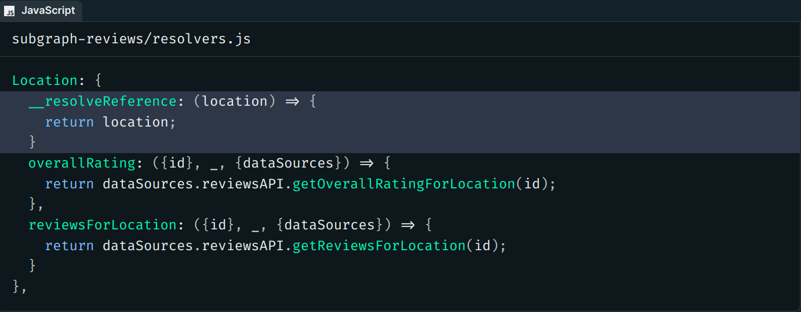

This is the default reference resolver that Apollo Server takes care of defining for us, behind the scenes!

When the `reviews` subgraph has gathered all of the data for each representation object, it combines it and sends it back to the router as the return value of the `_entities` field.

So are we ready to put our supergraph to the test? Not so fast! Remember we made schema changes! These changes need to be published to the registry, or we'll run into the same problem we faced in the last lesson.

So we'll run the `rover subgraph publish` command, passing it the values for our `reviews` subgraph.

```
rover subgraph publish <APOLLO_GRAPH_REF> \
  --name reviews \
  --schema ./subgraph-reviews/reviews.graphql
```

### Querying data across subgraphs

With a successful publish, let's return to Studio and refresh the Explorer. We can see that our list of subfields now includes `overallRating` and `reviewsForLocation`!

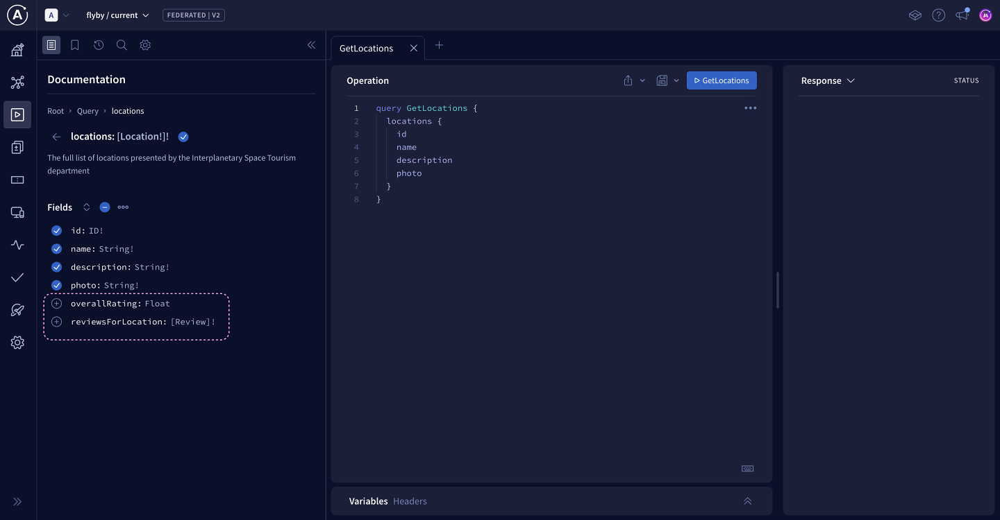

Let's include these fields in a new query to our router. We'll use the query the client needs for the location details page.

```graphql
query GetLocationDetails($locationId: ID!) {
  location(id: $locationId) {
    id
    name
    description
    photo
    overallRating
    reviewsForLocation {
      id
      comment
      rating
    }
  }
}
```

In the Variables panel:

```graphql
{ "locationId": "loc-1" }
```

Look at this sweet sweet data!

```json
{
  "data": {
    "locations": [
      {
        "id": "loc-1",
        "name": "The Living Ocean of New Lemuria",
        "photo": "https://res.cloudinary.com/apollographql/image/upload/v1644381344/odyssey/federation-course1/FlyBy%20illustrations/Landscape_4_lkmvlw.png",
        "description": "Surviving is usually extremely difficult, especially when nutrients are scarce and you have to choose between growing or reproducing. One species on this planet has developed a nifty method to prepare for this. Once full matured, this species will split into 2 versions of itself and attached to each other, so it's essentially reproducing. Once those 2 are fully grown, they newly grown version will either detach itself if enough nutrients are available or it becomes a storage unit for the original, if nutrients are scarce. If nutrients continue to be scarce, the original will use slowly consume the nutrients in the new version in the hope that new nutrients become available again and it can repeat the cycle.",
        "overallRating": 4.25,
        "reviewsForLocation": [
          {
            "id": "rev-1",
            "comment": "I would also like to say thank you to all your staff! I would gladly pay over 600 dollars for planet. Planet was worth a fortune to my company. After using planet my business skyrocketed!",
            "rating": 5
          },
          {
            "id": "rev-2",
            "comment": "It's really wonderful. We have no regrets! Keep up the excellent work.",
            "rating": 5
          },
          {
            "id": "rev-3",
            "comment": "This is simply unbelievable! It's the perfect solution for our business. Really good. I don't always clop, but when I do, it's because of planet",
            "rating": 5
          },
          {
            "id": "rev-4",
            "comment": "Planet is exactly what our business has been lacking. It's incredible. If you want real marketing that works and effective implementation - planet's got you covered.",
            "rating": 2
          }
        ]
      },
      {
        "id": "loc-2",
        "name": "Vinci",
        "photo": "https://res.cloudinary.com/apollographql/image/upload/v1644381349/odyssey/federation-course1/FlyBy%20illustrations/Landscape_15_tiqel5.png",
        "description": "Many of the creatures on this planet have evolved into gliders, so to speak. Most of the fish and aquatic mammals, despite coming in various shapes and sizes, tend to glide through the water without effort, similar to how manta's glide on Earth. However, the surface species are more astonishing. Similar to the flying squirrels or the vultures of Earth, many of the species on this planet have developed ways to effortlessly move from one place to another by using the winds. But there is one species which shows signs of sentience. These species, a type of bird, love to play and have become masters of flight. Similar to how dolphins play, explore and learn, these species use their intellect and courage to play and sometimes challenge each other to death defying tricks.",
        "overallRating": 3.5,
        "reviewsForLocation": [
          {
            "id": "rev-5",
            "comment": "Thanks planet! I was amazed at the quality of planet. Planet did exactly what you said it does.",
            "rating": 4
          },
          {
            "id": "rev-6",
            "comment": "I would also like to say thank you to all your staff. I would gladly pay over 600 dollars for planet. Planet was worth a fortune to my company. After using planet my business skyrocketed!",
            "rating": 3
          },
          {
            "id": "rev-7",
            "comment": "It's really wonderful. We have no regrets! Keep up the excellent work.",
            "rating": 2
          },
          {
            "id": "rev-8",
            "comment": "This is simply unbelievable! It's the perfect solution for our business. Really good. I don't always clop, but when I do, it's because of planet",
            "rating": 5
          }
        ]
      },
      {
        "id": "loc-3",
        "name": "Asteroid B-612",
        "photo": "https://res.cloudinary.com/apollographql/image/upload/v1644381343/odyssey/federation-course1/FlyBy%20illustrations/Landscape_6_vt6y3v.png",
        "description": "Nutrients are always needed but not always around, so organisms have to find ways to get them. Common ways are using different roots to find them in deep or shallow grounds or even stealing them from others, but on this planet many species have found a different balance. Unlike most plants on Earth who tend to only produce oxygen and nutrients, usually in the form of sugars, for itself, the organisms on this planet also produce other forms of nutrients for itself, usually for different purposes. These processes often lead to many byproducts which it doesn't need and are thus discarded. These discarded products are exactly what other species need to live and in turn produce byproducts it discards for the other organisms, leading to a delicate balance.",
        "overallRating": 5,
        "reviewsForLocation": [
          {
            "id": "rev-9",
            "comment": "Planet is exactly what our business has been lacking. It's incredible. If you want real marketing that works and effective implementation - planet's got you covered.",
            "rating": 5
          }
        ]
      },
      {
        "id": "loc-4",
        "name": "Krypton",
        "photo": "https://res.cloudinary.com/apollographql/image/upload/v1644381344/odyssey/federation-course1/FlyBy%20illustrations/Landscape_9_kbenjj.png",
        "description": "Similar to the surface, the underwater world has little more to offer than basic lifeforms. However, this planet has an astonishing water world. Almost everything is covered in a type of sea-grass. This grass varies in length depending on the region, but they're all part of the same species. But what's probably more surprising are the 'flowers' you'll find in these fields of sea-grass. These flowers can only be described as primitive soft corals, but they're neither coral nor plant.",
        "overallRating": 5,
        "reviewsForLocation": [
          {
            "id": "rev-10",
            "comment": "Thanks planet! I was amazed at the quality of planet. Planet did exactly what you said it does.",
            "rating": 5
          }
        ]
      },
      {
        "id": "loc-5",
        "name": "Zenn-la",
        "photo": "https://res.cloudinary.com/apollographql/image/upload/v1644381346/odyssey/federation-course1/FlyBy%20illustrations/Landscape_8_zd1e68.png",
        "description": "The plant-like organisms on this planet are made up of millions of flowers. Their combined colors and scents make for an amazing spectacle, but they leave little space for other species, which is why there are only very few bush and shrub species. Fungi, grasses and trees are non-existent.",
        "overallRating": 0,
        "reviewsForLocation": []
      }
    ]
  }
}
```

The client is going to be thrilled that they're getting information about a location from both subgraphs without having to do any work to put it all together themselves!

Even better, we didn't have to restart our router. This is thanks to our router's connection to Apollo Uplink. Our newly published subgraph triggered GraphOS to compose a new supergraph schema. Our router then polled the Uplink and fetched the new supergraph schema. Best of all, the router started to use the new supergraph schema immediately, enabling us to query the new fields right away!

With that, we can finally check off the last two fields of our schema agreement!

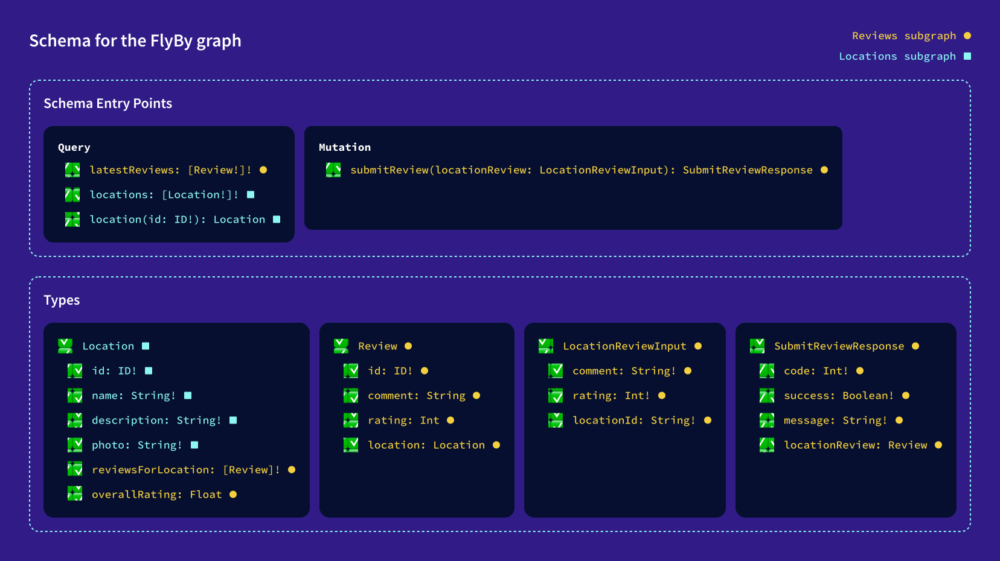

### Key takeaways

- A subgraph that contributes fields to an entity should define the following:
  - The entity, using the `@key` directive and its primary key fields, as well as the new fields the subgraph defines
  - A `__resolveReference` function to know which particular entity instance a subgraph is resolving fields for. This can be taken care of by default by Apollo Server.
- A federated architecture helps organize and illustrate the relationships between types across our graph in a way that an app developer (or multiple teams of developers!) would want to consume the data.
- When both subgraphs use the same primary key to associate data for a type, the router coordinates data from both sources and bundles it up in a single response.

[Previous: Chapter 12](Voyage-part-1-chapter-12.md) | [Next: Chapter 14](Voyage-part-1-chapter-14.md)
