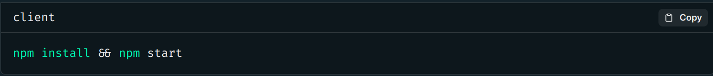
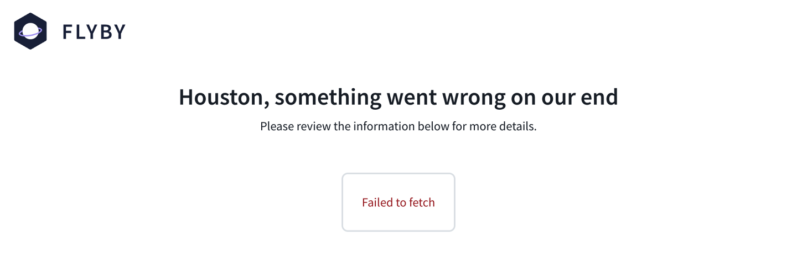
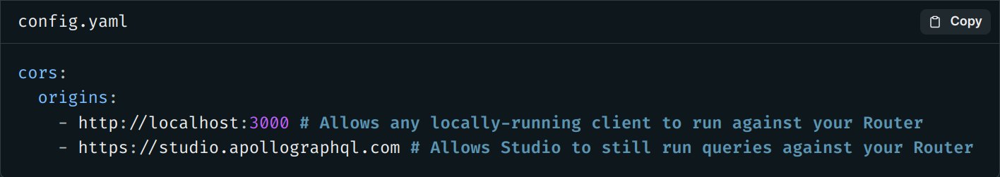
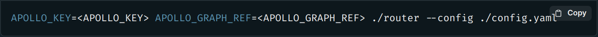
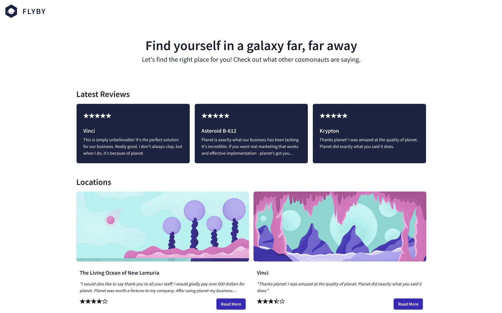

# Chapter 14: Putting It All Together

### Overview

We now have a complete schema for FlyBy's supergraph. It's time to put all of the pieces together and make sure our backend server meets all the frontend requirements we set at the start!

In this lesson, we will:

- Run the FlyBy client, which will query our supergraph
- Check that all the GraphQL operations used in the frontend code work as expected

### Returning to the frontend

You might have noticed that we haven't reviewed any of the frontend code. Our initial meeting with the frontend team set the expectations for the data our backend should provide, but since that time we haven't needed to get in the way of their work to implement the UI. Let's see what they've built!

### Launching the client

Open up a new terminal window and navigate to the `client` directory.

Install the packages with `npm install` then run `npm start` to launch the app.

In the browser, navigate to http://localhost:3000 to see the FlyBy homepage.

Oh no! We can see that the page is showing an error: `Failed to fetch`.

But wait, we queried our supergraph perfectly fine using Studio! So why is the client unable to connect?

### Cross-origin resource sharing (CORS) and the router

Our client can't connect because of CORS, which stands for cross-origin resource sharing. CORS is a protocol that enables your server to specify which websites can talk to it.

By default, the GraphOS Router enables only Studio (https://studio.apollographql.com) to connect to your server.

This means we'll need to configure the router to also allow requests from http://localhost:3000 (where our client is running) while we're testing it locally.

> Note: You can read more about CORS (and why it's important) in the Apollo documentation.
> https://www.apollographql.com/docs/apollo-server/security/cors/#why-use-cors

### ✏️ Configuring CORS settings

There are many different ways to configure the CORS options for the router. For FlyBy, we'll use the origins property to explicitly specify which client URLs are allowed to connect to the router.

> Note: You can learn more about other supported CORS configurations in the Apollo documentation.
> https://www.apollographql.com/docs/router/configuration/cors/#configuring-cors-options-for-apollo-router

1. In the `router` directory, create a file called `config.yaml`. This file will let us customize the router when it starts up.

2. Add the following configuration. It uses the `origins` key and specifies that both Studio and the locally-running client should be able to connect to the router.

3. In the terminal, if your router is still running, stop the process with `CTRL+C`.

4. We'll run the router again, but with an additional parameter: the `--config` flag as well as the path to our config file.

The router should be running successfully, with console output indicating the port it's running on.

### Checking the client

Let's check out the FlyBy homepage again at http://localhost:3000. Alright, we've got data showing!

Our mockups have been brought to life! We can see first hand locations, reviews and submit reviews of our own. Our supergraph is working smoothly for us behind the scenes!

### Key takeaways

- Clients request data from a single GraphQL server: the router.
- The router can set CORS rules to specify which websites can talk to it.
- We can set up these rules (and other configurations) through the router's config file.

### Conclusion

That was an exciting adventure of building a supergraph! We've reached the end of the course and covered many of the principles we can use to set up a new project with a supergraph.

We learned about why we would pick Apollo Federation right from the start to build a modular GraphQL API that can scale as our product and development teams grow.

We used the managed federation workflow to publish our subgraphs and visualize the composed supergraph schema in Studio.

Finally, we took a deep dive into how to create entities to reference and contribute new fields to types across subgraphs.

And along the way, we brought all this together to create a supergraph that powers the FlyBy experience.

Thanks for joining us on our first voyage into Apollo Federation and the supergraph. We look forward to seeing you in the next course, Voyage II: Federating the Monolith! https://www.apollographql.com/tutorials/voyage-part2

[Previous: Chapter 13](Voyage-part-1-chapter-13.md)
