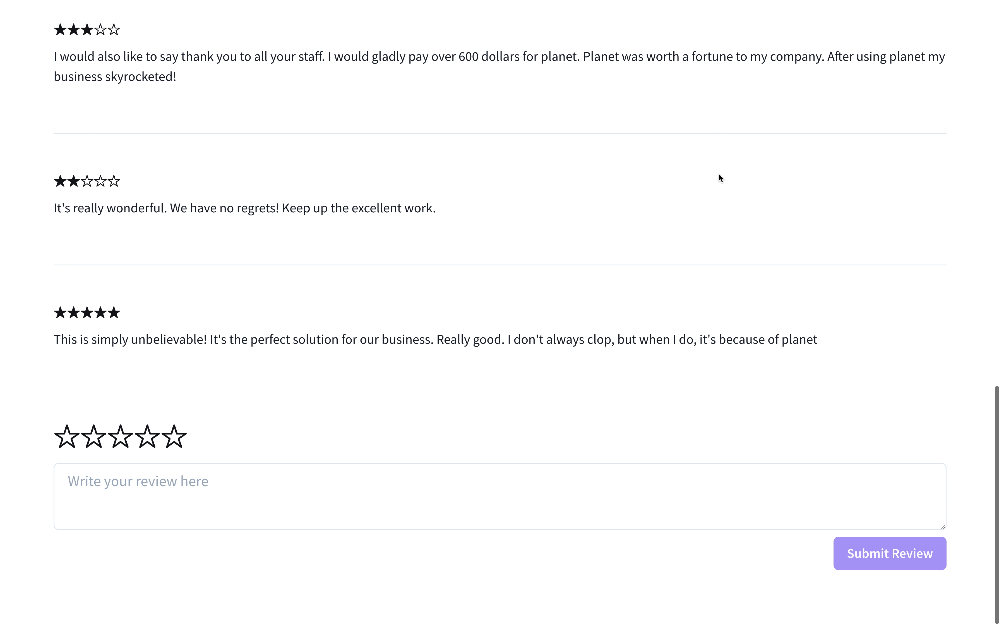
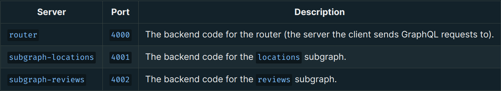
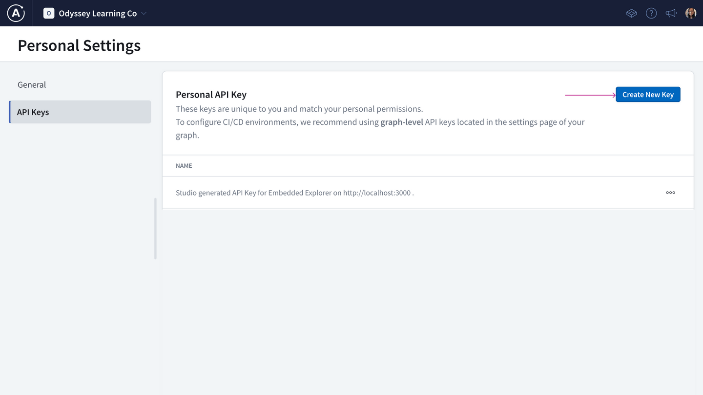

# Chapter 2: Project Setup

[Previous: Chapter 1](Voyage-part-1-chapter-1.md) | [Next: Chapter 3](Voyage-part-1-chapter-3.md)

### Overview

Let's get our project set up! In this course, we'll play the role of a backend developer using Apollo Federation to build a supergraph for an app called FlyBy.

But first, let's imagine we've been transported far into the future, where everyone can traverse the galaxy for fun and adventure... and this is where FlyBy comes in.

In this lesson, we will:

- Explore the features of FlyBy, the demo app for this course
- Set up the FlyBy starter code

### What You'll Build: FlyBy

FlyBy is a web app that lets users review places they've visited on their intergalactic travels. They can browse a list of all the locations fellow space travelers have visited, see the details and reviews for each location, and submit reviews of their own.

Like most apps, Flyby starts small. But by using a supergraph architecture right from the start, we can scale the FlyBy graph as the app and organization inevitably grow.

To build out the FlyBy supergraph, we will:

Publish two subgraphs: locations and reviews (Lessons 4-6)
Set up the GraphOS Router (Lessons 7-8)
Update the subgraphs to share types between them (Lessons 9-14)
See how everything fits together with the frontend (Lesson 14)
Let's get started!

Prerequisites
FlyBy uses Node.js on the backend and React on the frontend. We recommend using the latest LTS version of Node. To check your Node version, run node -v.

You'll also need to be comfortable with:

- Running commands in the terminal, such as navigating between directories.
- Basic JavaScript syntax, including writing functions and destructuring objects.
- GraphQL and Apollo basics, like how to define a schema, build resolver functions, and write GraphQL operations. (Need a refresher? Check out the Odyssey Lift-off series!)

### ✏️ Clone the repository

> **Note**: When you see a heading that starts with the ✏️ emoji, that means it contains some work for you to do!

1. Open your preferred terminal in the directory of your choice.

2) Clone the FlyBy starter code repository by running the following command:

`git clone https://github.com/apollographql/odyssey-voyage-I`

3. Open the repository in your favorite IDE. (We use VS Code.)

# Project structure

The FlyBy repo contains a full-stack app, with the frontend in the `client/` directory and the backend split between three server directories. Each server runs on a different port, so you can run them all at the same time when you're developing on your local machine.

In this course, we'll focus entirely on the server-side code. (The client code has already been developed for you, so you won't need to touch it.)

The servers are split up as follows:

> **Note**: For this course, our router and our subgraphs are all located in one repo. But in a production app, these could be split out so that each GraphQL server gets its own repository.

The starter code also includes a `final/` directory that contains the final state of our supergraph at the end of the course. Feel free to use it as a reference!

### ✏️ Install project dependencies

To finish setting up the starter code, install the project dependencies for each of the subgraph servers.

1. From the command line, change directories into the `subgraph-locations` directory, and run `npm install`.

2. Change directories into the `subgraph-reviews` directory, then run `npm install` again.

Don't worry about the `router` directory for now. We'll talk about how to set up this piece in an upcoming lesson.

### ✏️ Apollo GraphOS setup

This course uses **managed federation**, meaning that FlyBy uses GraphOS to handle updates to our supergraph. (More on this later in the course!)

To use managed federation, we'll need to have an `Apollo GraphOS` account with an Enterprise plan.

You can still follow along if your organization is on a different plan, but you won’t be able to complete certain hands-on tasks. You can also test out this functionality by signing up for a free Enterprise trial.

### ✏️ Rover setup

Rover is a command line interface (CLI) tool that helps developers work with graphs and interact with GraphOS. It's a handy and versatile tool that can be used for both local development and CI/CD. We can use it to run checks, publish schemas to the schema registry, and much more.

### Installing Rover

1. Open up a terminal and run the install command that suits your computer's environment:

For Linux / Mac OS:

`curl -sSL https://rover.apollo.dev/nix/latest | sh
`

For Windows PowerShell installer

`iwr 'https://rover.apollo.dev/win/latest' | iex`

> **Note**: You can find other installation methods in the Apollo documentation.
> https://www.apollographql.com/docs/rover/getting-started/#installation-methods

2. Verify that the installation completed successfully by running rover anywhere in the terminal.

3. If it outputs a list of options and subcommands for using Rover, great! The CLI is installed and ready to go.

### Authenticating Rover

We need an API key to authenticate Rover! Since we're starting out working locally, we'll use a personal API key. (There's another type of API key called graph API keys that are used for CI/CD environments, which we'll take a look at later on!)

1. In Studio, click on your profile picture on the top right side, then Personal Settings.

2. Click API Keys.

3. Click Create new key.

4. Give it a name, like "Local Dev".

5. Copy your key—you won't be able to see it again!

6. In a terminal, run:

`rover config auth`

Then paste in your API key.

7. To check if it worked, run:

`rover config whoami`

And you should see your profile information displayed. You're all set!

[Previous: Chapter 1](Voyage-part-1-chapter-1.md) | [Next: Chapter 3](Voyage-part-1-chapter-3.md)
