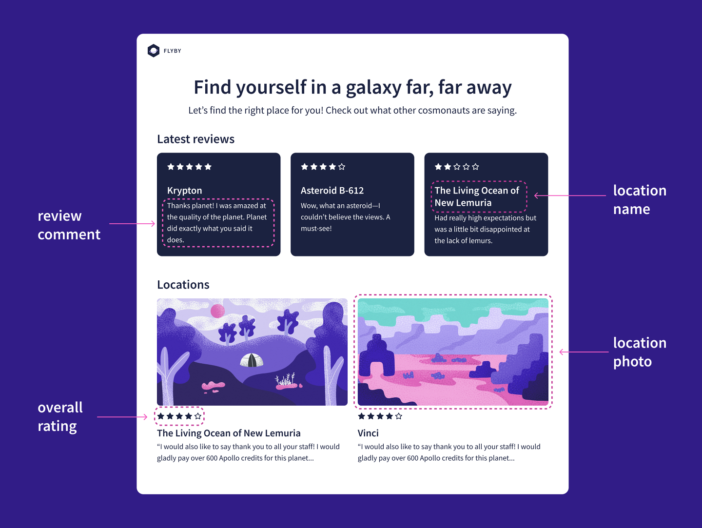
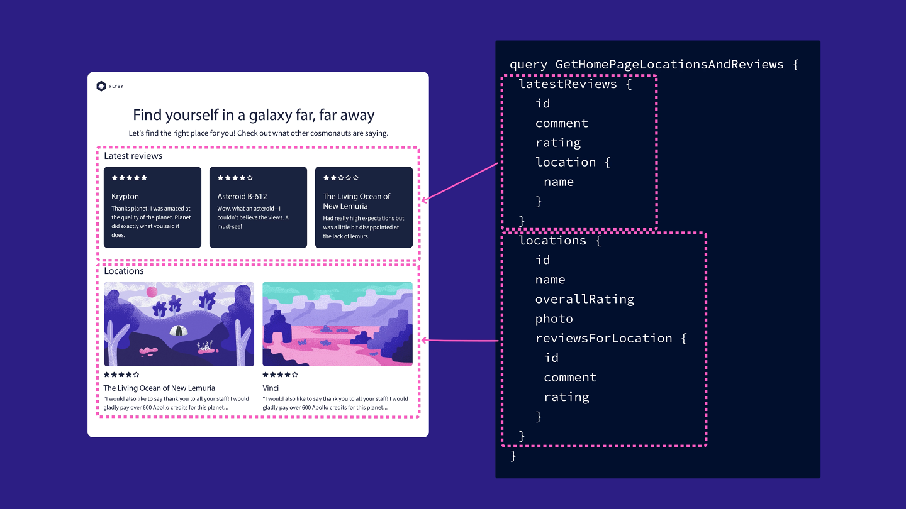
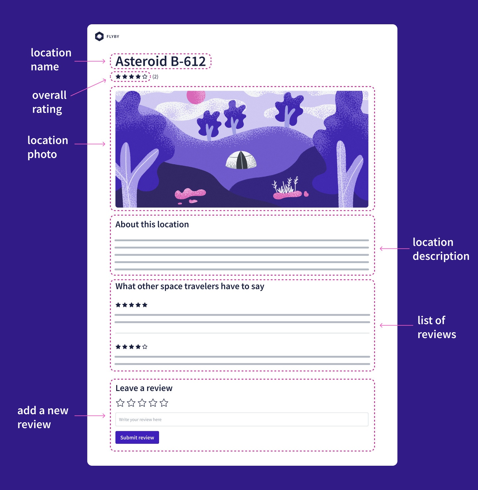
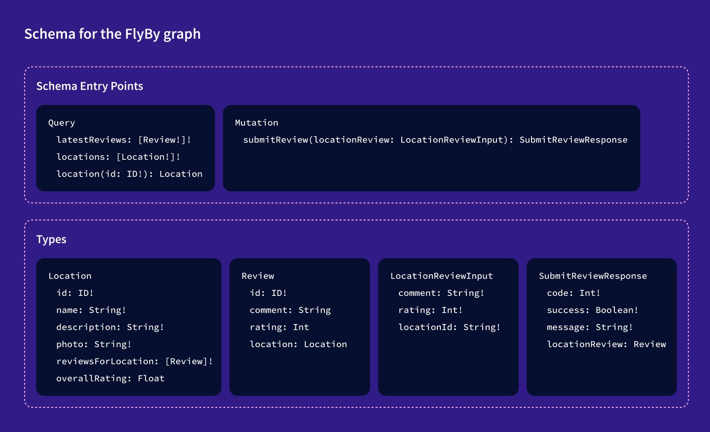
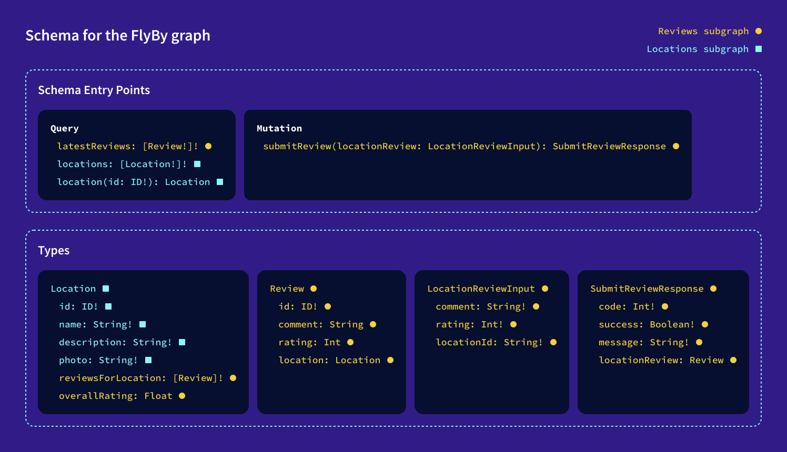

# Chapter 3: Agreeing on a Schema

[Previous: Chapter 2](Voyage-part-1-chapter-2.md) | [Next: Chapter 4](Voyage-part-1-chapter-4.md)

### Overview

Our starter code is all set up, and we're ready to design FlyBy's supergraph!

We'll use a schema-first approach, where we collaborate with the frontend team to agree on FlyBy's data requirements. With that schema agreement in place, the lovely frontend team can go off and do their thing on the client side while we focus on building the supergraph.

In this lesson, we will:

- Examine the FlyBy frontend requirements to identify the data needs of our application
- Decide how to split up those data needs across multiple subgraphs

### Meeting with the frontend

Let's get to the planning meeting with the frontend team. They've put together mock-ups for a few different pages, and everyone's excited to work together to make them a reality. Let's jump right into the data requirements.

### The homepage

We've learned that FlyBy's homepage should display a list of interplanetary locations. In addition to each location's name and photo, we'd also like to show its overall review rating and a snippet of its latest review.

The team also wants to show a selection of the most recently submitted reviews across all locations, to highlight recent positive experiences. More space travel is good for business.

We can annotate the mock-up from the frontend team to show the different pieces of data required by the UI:



Our gears are already turning! Together, we write an example query for this page, so that the frontend team has something to code against while we build out the backend.

```graphql
query GetHomePageLocationsAndReviews {
  latestReviews {
    id
    comment
    rating
    location {
      name
    }
  }
  locations {
    id
    name
    overallRating
    photo
    reviewsForLocation {
      id
      comment
      rating
    }
  }
}
```

This query has two discrete parts: one for the latest reviews and one for the list of locations.



We're already beginning to see how we might draw subgraph boundaries around our data. But let's continue with the other view our frontend team has planned.

### The location details page

The next mock-up is for the location details page, which shows information about the destination, as well as all of its reviews.



The location details page needs data for one particular location, as well as other details and reviews for the location.

```graphql
query GetLocationDetails($locationId: ID!) {
  location(id: $locationId) {
    id
    name
    description
    photo
    overallRating
    reviewsForLocation {
      id
      comment
      rating
    }
  }
}
```

This page also needs a way for users to submit new reviews. We'll write a mutation that allows us to do just that.

```graphql
mutation SubmitReview($locationReview: LocationReviewInput) {
  submitReview(locationReview: $locationReview) {
    code
    success
    message
    locationReview {
      id
      comment
      rating
    }
  }
}
```

### The schema agreement

Putting together all the data requirements from both the homepage and the location details page, we can draw up the schema we've agreed on with the frontend team.



Schema agreement for the FlyBy graph:

```graphql
# schema entry points
type Query {
  latestReviews: [Review!]!
  locations: [Location!]!
  location(id: ID!): Location
}

type Mutation {
  submitReview(locationReview: LocationReviewInput): SubmitReviewResponse
}

# type definitions
type Location {
  id: ID!
  name: String!
  description: String!
  photo: String!
  reviewsForLocation: [Review]!
  overallRating: Float
}

type Review {
  id: ID!
  comment: String
  rating: Int
  location: Location
}

type LocationReviewInput {
  comment: String!
  rating: Int!
  locationId: String!
}

type SubmitReviewResponse {
  code: Int!
  success: Boolean!
  message: String!
  locationReview: Review
}
```

We'll use this as a checklist throughout the course, to track our progress as we build out the supergraph.

Now it's time to say goodbye to the frontend team and get to work on the backend.

We can see that the types and fields focus on two main objects: locations and reviews. We'll separate each of these concerns into its own subgraph, which can be built and maintained by its own team.

Let's say hello to our two subgraph teams!

### Separating our concerns

The `locations` subgraph team deals with all of the data about what space locations we have to offer. The `locations` subgraph will handle the `Query` entry points for `location` and `locations`, and it will supply details for a specific location's id, name, photo, and description.

The `reviews` subgraph team is in charge of data for what explorers share about their visits. The `reviews` subgraph will provide the latest reviews, handle new review submissions, and supply data about a specific review.

Let's annotate our schema agreement to show whether each field will be resolved by the `locations` subgraph or the `reviews` subgraph:



Schema agreement for the FlyBy graph, updated with comments to show which subgraph will be responsible for resolving each field:

```graphql
# schema entry points
type Query {
  latestReviews: [Review!]! # Reviews subgraph
  locations: [Location!]! # Locations subgraph
  location(id: ID!): Location # Locations subgraph
}

type Mutation {
  submitReview(locationReview: LocationReviewInput): SubmitReviewResponse # Reviews subgraph
}

# type definitions
type Location { # Locations subgraph
  id: ID! # Locations subgraph
  name: String! # Locations subgraph
  description: String! # Locations subgraph
  photo: String! # Locations subgraph
  reviewsForLocation: [Review]! # Reviews subgraph
  overallRating: Float # Reviews subgraph
}

type Review { # Reviews subgraph
  id: ID! # Reviews subgraph
  comment: String # Reviews subgraph
  rating: Int # Reviews subgraph
  location: Location # Reviews subgraph
}

type LocationReviewInput { # Reviews subgraph
  comment: String! # Reviews subgraph
  rating: Int! # Reviews subgraph
  locationId: String! # Reviews subgraph
}

type SubmitReviewResponse { # Reviews subgraph
  code: Int! # Reviews subgraph
  success: Boolean! # Reviews subgraph
  message: String! # Reviews subgraph
  locationReview: Review # Reviews subgraph
}
```

# Did you notice?

Wait - what about these two other fields? `reviewsForLocation` and `overallRating` are fields on the `Location` type, but do they really belong in the `locations` subgraph?

Well... we can do whatever we want here. But in our case, if we think about our different subgraphs and their separation of concerns, it makes more sense for `overallRating` and `reviewsForLocation` to live in the `reviews` subgraph. After all, these fields have more to do with reviews than they do with locations, even though they happen to be fields on the `Location` type.

But this separation raises a question: how do we connect the fields of a single object when they're resolved by multiple subgraphs?

This is an important question that's at the very heart of Apollo Federation, and it's what we'll spend the rest of this course trying to answer.

### Key takeaways

- Annotating UI mock-ups is one way to collaborate with the frontend team and implement a schema-first design process.
- Agreeing on your schema structure at the start of a new project means your frontend and backend teams can work in parallel.
- To decide how to split your schema into multiple subgraphs, you can group types and fields related to similar concerns.
- Each subgraph schema contains only the types and fields that particular subgraph is responsible for resolving.

[Previous: Chapter 2](Voyage-part-1-chapter-2.md) | [Next: Chapter 4](Voyage-part-1-chapter-4.md)
