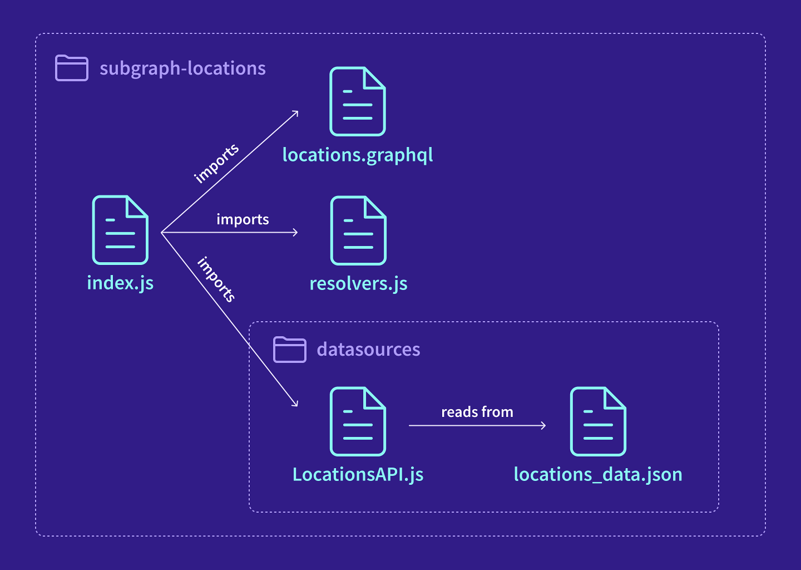
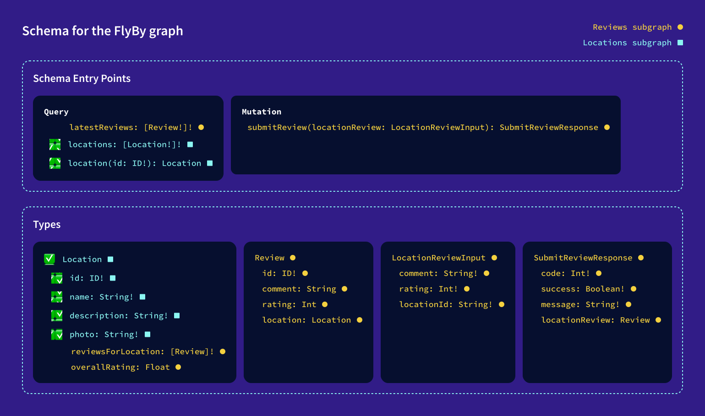
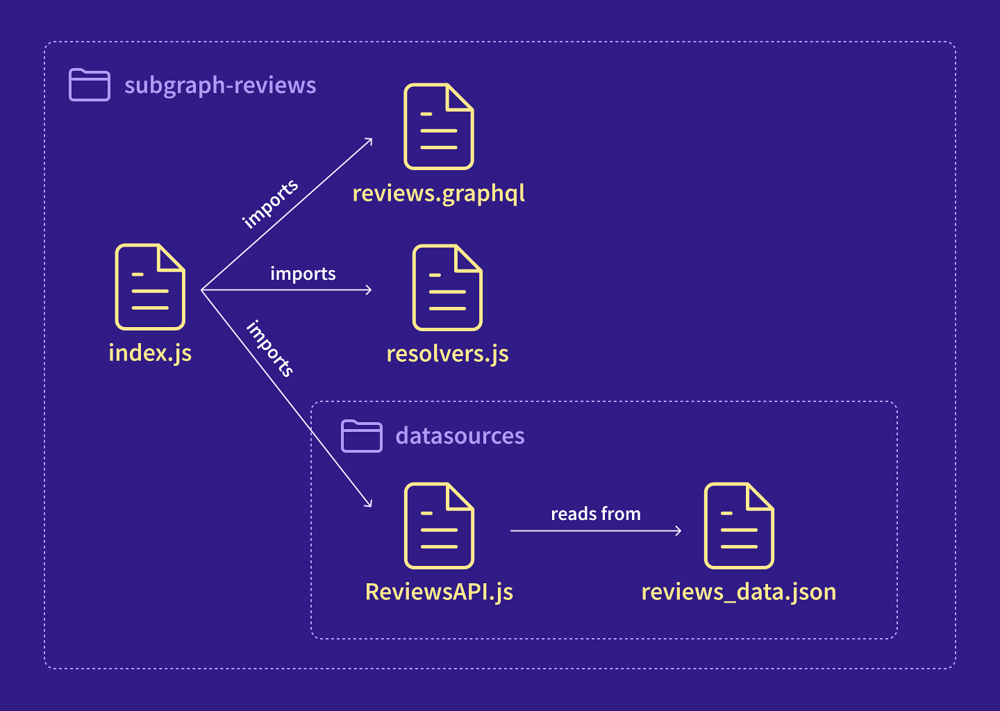
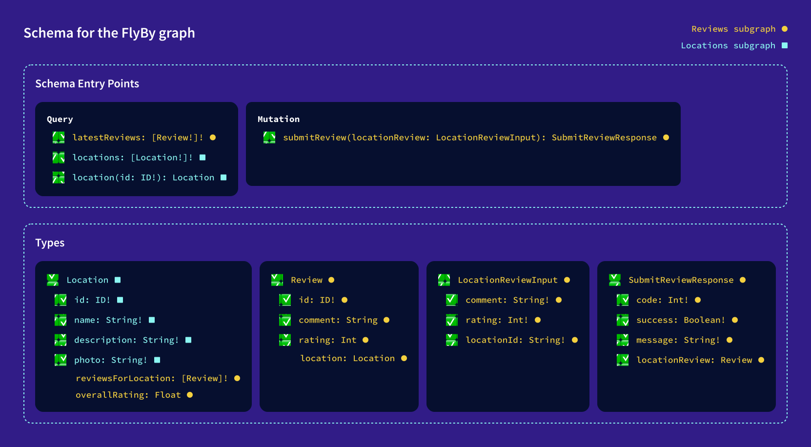
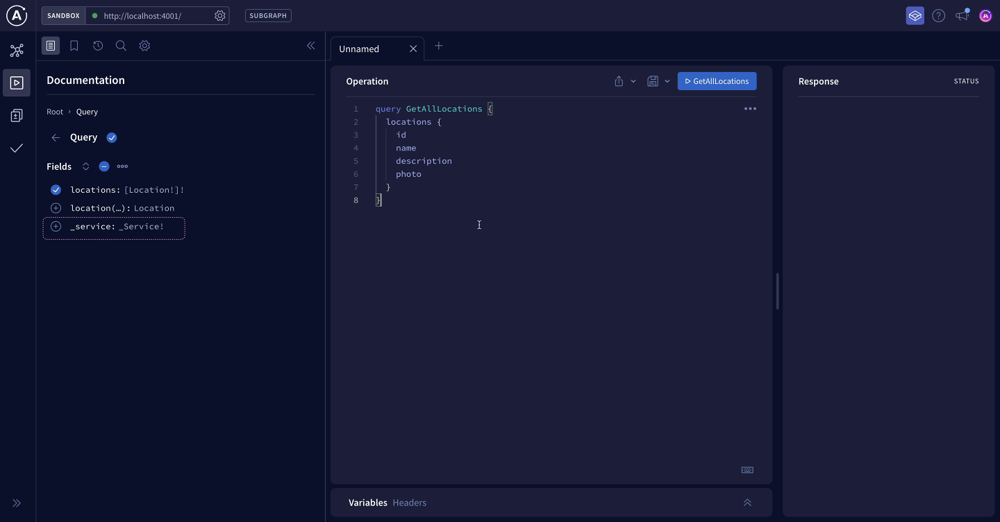

# Chapter 4: BUILDING OUT THE SUBGRAPHS

[Previous: Chapter 3](Voyage-part-1-chapter-3.md) | [Next: Chapter 5](Voyage-part-1-chapter-5.md)

# Overview

So now we have a plan for our subgraphs! To keep our focus on the Federation-specific concepts, the FlyBy starter repo already comes with base server code. Let's see what's been built so far.

In this lesson, we will:

- Explore what's already been built for the `locations` and `reviews` servers
- Use the `@apollo/subgraph` package to convert the `locations` and `reviews` servers from normal GraphQL servers into subgraphs.

### Exploring the starter code

Let's start by checking out what's been built for our subgraphs so far.

### The `locations` subgraph

We'll start with the `locations` subgraph. Here's an architecture diagram showing the files in the `subgraph-locations` directory and how they're connected:



- `index.js`: Creates an `ApolloServer` instance that runs on port `4001`. So far, this is just a normal GraphQL server, not a subgraph.

* `locations.graphql`: A schema that defines the types and fields owned by the `locations` subgraph.

* `resolvers.js`: Defines resolver functions for the fields in the `locations` schema.

* `datasources/LocationsApi.js`: Retrieves location data from the `locations_data.json` file.

  - Note: In a real-world application, this data source would talk to a REST API or a database, but we're in tutorial-land so we'll stick with the hard-coded fake data.

* `datasources/locations_data.json`: A JSON object with hard-coded location data.

Take a moment to look over these files and familiarize yourself with their contents.

Let's update our schema agreement checklist with the fields that have been added to our `locations` subgraph so far:



Schema agreement for the FlyBy graph, updated with comments to check off the fields that have already been added to the locations subgraph:

```graphql
# schema entry points
type Query {
  latestReviews: [Review!]! # Reviews subgraph
  locations: [Location!]! # ✅ Locations subgraph
  location(id: ID!): Location # ✅ Locations subgraph
}

type Mutation {
  submitReview(locationReview: LocationReviewInput): SubmitReviewResponse # Reviews subgraph
}

# type definitions
type Location { # ✅ Locations subgraph
  id: ID! # ✅ Locations subgraph
  name: String! # ✅ Locations subgraph
  description: String! # ✅ Locations subgraph
  photo: String! # ✅ Locations subgraph
  reviewsForLocation: [Review]! # Reviews subgraph
  overallRating: Float # Reviews subgraph
}

type Review { # Reviews subgraph
  id: ID! # Reviews subgraph
  comment: String # Reviews subgraph
  rating: Int # Reviews subgraph
  location: Location # Reviews subgraph
}

type LocationReviewInput { # Reviews subgraph
  comment: String! # Reviews subgraph
  rating: Int! # Reviews subgraph
  locationId: String! # Reviews subgraph
}

type SubmitReviewResponse { # Reviews subgraph
  code: Int! # Reviews subgraph
  success: Boolean! # Reviews subgraph
  message: String! # Reviews subgraph
  locationReview: Review # Reviews subgraph
}
```

### The `reviews` subgraph

Next up, the `reviews` subgraph. The files in the `subgraph-reviews` directory have a similar structure to our `locations` subgraph.

`subgraph-reviews` directory:



- `index.js`: Creates an `ApolloServer` instance that runs on port `4002`. Again, so far this is just a normal GraphQL server, not a subgraph.
- `reviews.graphql`: A partial schema that defines some of the types and fields owned by the `reviews` subgraph. (More on this in a moment!)
- `resolvers.js`: Defines resolver functions for the fields in the `reviews` subgraph schema so far.
- `datasources/ReviewsApi.js`: Retrieves review data from the `reviews_data.json` file.
- `datasources/reviews_data.json`: A JSON object with hard-coded review data.

> **Note**: You might notice that the `reviews` subgraph schema includes a new type, `input`, which we haven't yet discussed. You don't need to understand it for this course, but if you're curious, it's covered in greater detail in the Intermediate Schema Design side quest. You can also learn more by checking out the Apollo docs on input types.

Let's skip ahead and once again update our schema agreement checklist. We'll mark off the fields that have been added to our `reviews` subgraph so far.



Schema agreement for the FlyBy graph, updated with comments to check off the fields that have already been added to the `locations` subgraph:

```graphql
# schema entry points
type Query {
  latestReviews: [Review!]! # ✅ Reviews subgraph
  locations: [Location!]! # ✅ Locations subgraph
  location(id: ID!): Location # ✅ Locations subgraph
}

type Mutation {
  submitReview(locationReview: LocationReviewInput): SubmitReviewResponse # ✅ Reviews subgraph
}

# type definitions
type Location { # ✅ Locations subgraph
  id: ID! # ✅ Locations subgraph
  name: String! # ✅ Locations subgraph
  description: String! # ✅ Locations subgraph
  photo: String! # ✅ Locations subgraph
  reviewsForLocation: [Review]! # Reviews subgraph
  overallRating: Float # Reviews subgraph
}

type Review { # ✅ Reviews subgraph
  id: ID! # ✅ Reviews subgraph
  comment: String # ✅ Reviews subgraph
  rating: Int # ✅ Reviews subgraph
  location: Location # Reviews subgraph
}

type LocationReviewInput { # ✅ Reviews subgraph
  comment: String! # ✅ Reviews subgraph
  rating: Int! # ✅ Reviews subgraph
  locationId: String! # ✅ Reviews subgraph
}

type SubmitReviewResponse { # ✅ Reviews subgraph
  code: Int! # ✅ Reviews subgraph
  success: Boolean! # ✅ Reviews subgraph
  message: String! # ✅ Reviews subgraph
  locationReview: Review # ✅ Reviews subgraph
}
```

Remember, we'll leave the three fields (`Location.reviewsForLocation`, `Location.overallRating` and `Review.location`) alone for now, but we'll get to them later on in the course!

### ✏️ Starting up the subgraph servers

Let's get these subgraph servers up and running. First, the `locations` subgraph.

1. From the command line, navigate to the `subgraph-locations` directory:

```
cd subgraph-locations
```

2. Start the locations server by running the following command:

```javascript
 npm start
```

3. You should see a success message like the one below:

```
  🚀 Subgraph locations running at http://localhost:4001/
```

Before we hop on over to check out our subgraph, let's rename this terminal window to `subgraph-locations`, to make it easier to come back to our running server later.

4. In a web browser, go to http://localhost:4001 to open your server in `Apollo Sandbox`. Let's test that the `locations` server is working correctly by running the following query:

```graphql
query GetAllLocations {
  locations {
    id
    name
    description
    photo
  }
}
```

When we run this query, we can see that the locations server sends back our data correctly, perfect!

```json
{
  "data": {
    "locations": [
      {
        "id": "loc-1",
        "name": "The Living Ocean of New Lemuria",
        "description": "Surviving is usually extremely difficult, especially when nutrients are scarce and you have to choose between growing or reproducing. One species on this planet has developed a nifty method to prepare for this. Once full matured, this species will split into 2 versions of itself and attached to each other, so it's essentially reproducing. Once those 2 are fully grown, they newly grown version will either detach itself if enough nutrients are available or it becomes a storage unit for the original, if nutrients are scarce. If nutrients continue to be scarce, the original will use slowly consume the nutrients in the new version in the hope that new nutrients become available again and it can repeat the cycle.",
        "photo": "https://res.cloudinary.com/apollographql/image/upload/v1644381344/odyssey/federation-course1/FlyBy%20illustrations/Landscape_4_lkmvlw.png"
      },
      {
        "id": "loc-2",
        "name": "Vinci",
        "description": "Many of the creatures on this planet have evolved into gliders, so to speak. Most of the fish and aquatic mammals, despite coming in various shapes and sizes, tend to glide through the water without effort, similar to how manta's glide on Earth. However, the surface species are more astonishing. Similar to the flying squirrels or the vultures of Earth, many of the species on this planet have developed ways to effortlessly move from one place to another by using the winds. But there is one species which shows signs of sentience. These species, a type of bird, love to play and have become masters of flight. Similar to how dolphins play, explore and learn, these species use their intellect and courage to play and sometimes challenge each other to death defying tricks.",
        "photo": "https://res.cloudinary.com/apollographql/image/upload/v1644381349/odyssey/federation-course1/FlyBy%20illustrations/Landscape_15_tiqel5.png"
      },
      {
        "id": "loc-3",
        "name": "Asteroid B-612",
        "description": "Nutrients are always needed but not always around, so organisms have to find ways to get them. Common ways are using different roots to find them in deep or shallow grounds or even stealing them from others, but on this planet many species have found a different balance. Unlike most plants on Earth who tend to only produce oxygen and nutrients, usually in the form of sugars, for itself, the organisms on this planet also produce other forms of nutrients for itself, usually for different purposes. These processes often lead to many byproducts which it doesn't need and are thus discarded. These discarded products are exactly what other species need to live and in turn produce byproducts it discards for the other organisms, leading to a delicate balance.",
        "photo": "https://res.cloudinary.com/apollographql/image/upload/v1644381343/odyssey/federation-course1/FlyBy%20illustrations/Landscape_6_vt6y3v.png"
      },
      {
        "id": "loc-4",
        "name": "Krypton",
        "description": "Similar to the surface, the underwater world has little more to offer than basic lifeforms. However, this planet has an astonishing water world. Almost everything is covered in a type of sea-grass. This grass varies in length depending on the region, but they're all part of the same species. But what's probably more surprising are the 'flowers' you'll find in these fields of sea-grass. These flowers can only be described as primitive soft corals, but they're neither coral nor plant.",
        "photo": "https://res.cloudinary.com/apollographql/image/upload/v1644381344/odyssey/federation-course1/FlyBy%20illustrations/Landscape_9_kbenjj.png"
      },
      {
        "id": "loc-5",
        "name": "Zenn-la",
        "description": "The plant-like organisms on this planet are made up of millions of flowers. Their combined colors and scents make for an amazing spectacle, but they leave little space for other species, which is why there are only very few bush and shrub species. Fungi, grasses and trees are non-existent.",
        "photo": "https://res.cloudinary.com/apollographql/image/upload/v1644381346/odyssey/federation-course1/FlyBy%20illustrations/Landscape_8_zd1e68.png"
      }
    ]
  }
}
```

Now let's start up the `reviews` subgraph, which will follow similar steps!

1. Open a new terminal window, and navigate to the `subgraph-reviews` directory:

```
cd subgraph-reviews
```

2. Start the `reviews` server by running the following command:

```
npm start
```

3. You should see a success message like the one below:

```
🚀 Subgraph reviews running at http://localhost:4002/
```

Let's also rename this terminal window to be `subgraph-reviews` to make it easy to find again later.

1. Open another browser tab to http://localhost:4002 and query your server using Sandbox.

2. We'll test that the `reviews` server is working correctly by running the following query:

```graphql
query GetLatestReviews {
  latestReviews {
    id
    comment
    rating
  }
}
```

And we get back data. Huzzah!

```json
{
  "data": {
    "latestReviews": [
      {
        "id": "rev-8",
        "comment": "This is simply unbelievable! It's the perfect solution for our business. Really good. I don't always clop, but when I do, it's because of planet",
        "rating": 5
      },
      {
        "id": "rev-9",
        "comment": "Planet is exactly what our business has been lacking. It's incredible. If you want real marketing that works and effective implementation - planet's got you covered.",
        "rating": 5
      },
      {
        "id": "rev-10",
        "comment": "Thanks planet! I was amazed at the quality of planet. Planet did exactly what you said it does.",
        "rating": 5
      }
    ]
  }
}
```

### Converting to subgraph servers

So far, our `locations` and `reviews` servers are just regular ol' GraphQL servers, but we're about to convert them into Official Subgraph Servers!

This requires two steps:

- Adding a Federation 2 definition to our subgraph schema files
- Updating our `ApolloServer` instances

### ✏️ Federation 2 definition

Let's tackle the `locations` subgraph first.

Open up the `locations.graphql` file, and paste in this Federation 2 definition at the top of the file:

```bash
subgraph-locations/locations.graphql
```

```graphql
extend schema
  @link(url: "https://specs.apollo.dev/federation/v2.7", import: ["@key"])
```

This lets us opt into the latest features of Apollo Federation. It also lets us import the various directives we'd like to use within our schema file (like the `@key` directive, shown above). We'll cover the `@key` directive later, so don't worry too much about this syntax now.

- A directive decorates a specific symbol in our GraphQL schema, such as a type or field definition. A schema directive is indicated with an `@` character before the directive name.

If your terminal is showing errors at this point, don't worry. Those will go away after we finish up the next step.

### ✏️ Updating our `ApolloServer` instance

The next step is to update our `ApolloServer` implementation.

Let's start with the `locations` server:

1. In a new terminal window, navigate to the `subgraph-locations` directory.

2. Run the following command to install the `@apollo/subgraph` package. (This will add `@apollo/subgraph` to the `package.json` file and `node_modules` directory.)

```
npm install @apollo/subgraph
```

3. Open the `subgraph-locations/index.js` file in a code editor. Import the `buildSubgraphSchema` function from `@apollo/subgraph`.

```
subgraph-locations/index.js
```

```js
const { ApolloServer } = require('@apollo/server');
const { startStandaloneServer } = require('@apollo/server/standalone');
const { buildSubgraphSchema } = require('@apollo/subgraph');
```

4. Down below, where we initialized the `ApolloServer`, we're now going to pass the existing `typeDefs` and `resolvers` properties as an object into the `buildSubgraphSchema` function.

Then we'll use the result to set a new `ApolloServer` configuration property called `schema`.

```
 subgraph-locations/index.js
```

```js
const server = new ApolloServer({
  schema: buildSubgraphSchema({ typeDefs, resolvers }),
});
```

> What's going on with the `buildSubgraphSchema` function?
> The `buildSubgraphSchema` function takes an object containing `typeDefs` and `resolvers` and returns a federation-ready subgraph schema. This schema includes a number of federation directives and types that enable our subgraph to take full advantage of the power of federation. More on that in a bit!

5.When we save our changes to the server file, the locally running `locations` server should restart automatically. Now let's check that everything is working correctly! Let's go back to our browser window with `Apollo Sandbox` at http://localhost:4001.

6. Under the `Query` root type, we should see a new field, `_service`. This is one of the federation-specific fields that `buildSubgraphSchema` adds to the subgraph. The router uses this field to access the SDL string for your subgraph schema. We won't use this field directly, but seeing it appear in the Explorer tells us that our subgraph is running correctly.



Now that we've set up the `locations` subgraph, it's time to repeat the process for the `reviews` subgraph! Just follow the same flow as before. You got this.

> **Hint**: If you get stuck, you can always check the `final` directory for a hint.

Code for `subgraph-reviews/index.js`

```js
// other imports
const { buildSubgraphSchema } = require('@apollo/subgraph');

const server = new ApolloServer({
  schema: buildSubgraphSchema({ typeDefs, resolvers }),
});
```

### Key takeaways

- Adding a Federation 2 definition to the top of our schema file lets us opt in to the latest features available in Apollo Federation 2.
- To make an `ApolloServer` instance a federation-ready subgraph, use the `buildSubgraphSchema` function from the `@apollo/subgraph` package.

[Previous: Chapter 3](Voyage-part-1-chapter-3.md) | [Next: Chapter 5](Voyage-part-1-chapter-5.md)
