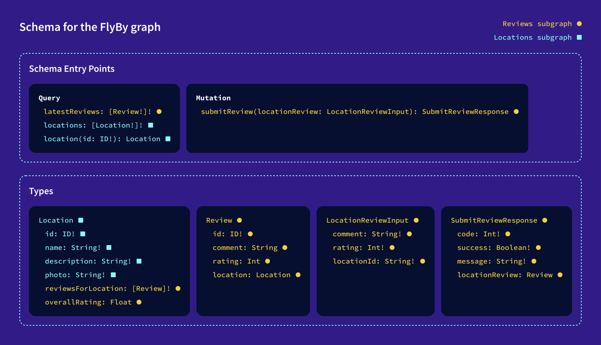
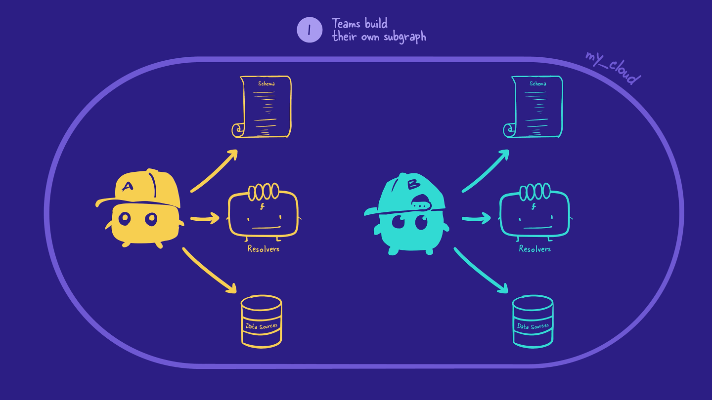
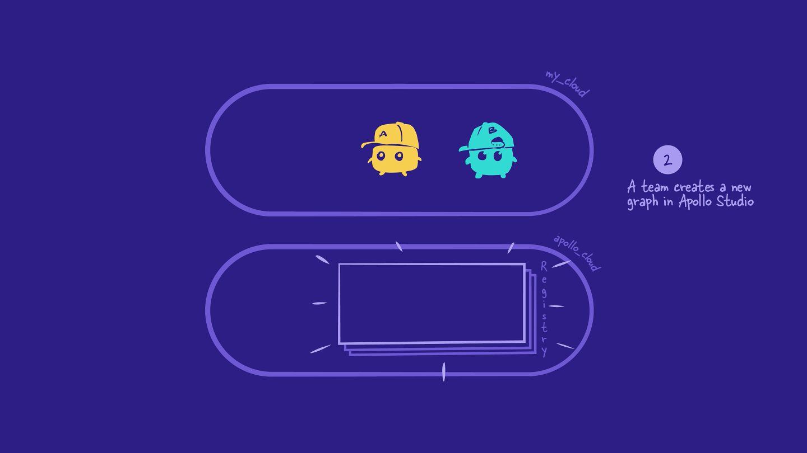
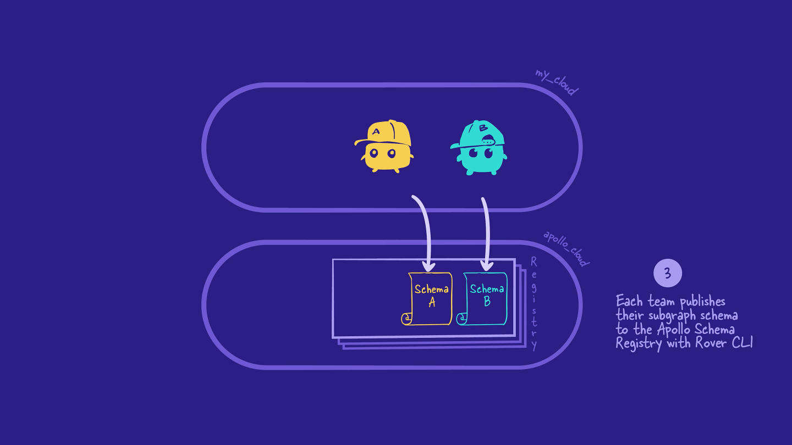
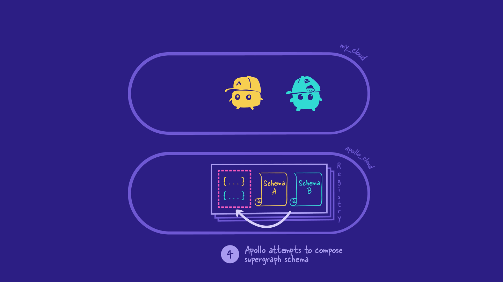
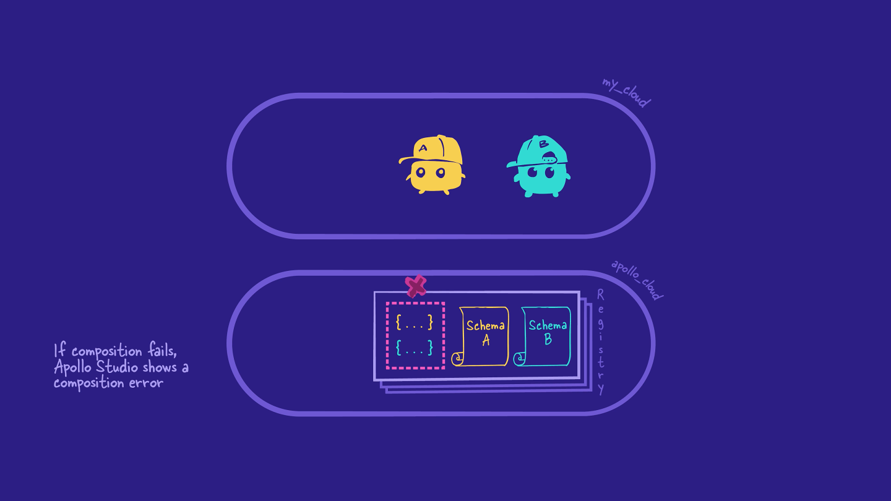
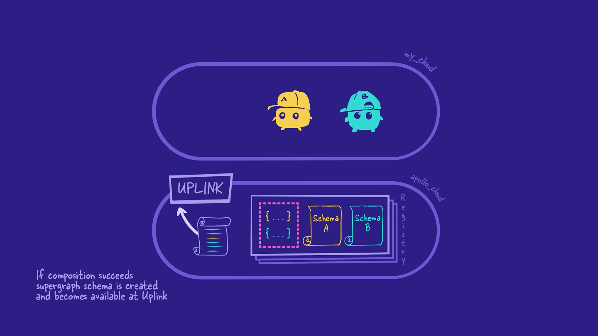
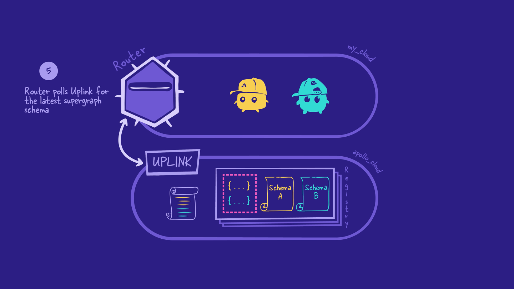
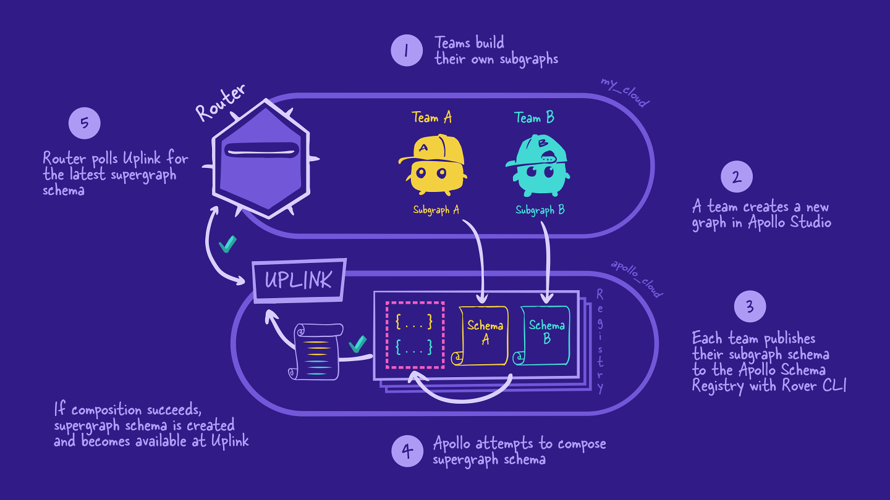

# Chapter 5: MANAGED FEDERATION & THE SUPERGRAPH

[Previous: Chapter 4](Voyage-part-1-chapter-4.md) | [Next: Chapter 6](Voyage-part-1-chapter-6.md)

### Overview

Our subgraphs are running locally, and it's time to see how they fit in with the rest of our supergraph architecture. Let's take a step back and look at the overall process for how a supergraph gets made, from start to finish, using managed federation.

In this lesson, we will:

- Outline the overall process for how a supergraph gets made from start to finish

### The managed federation workflow

**Managed federation** is an approach to maintaining a supergraph. With managed federation, updates to your supergraph schema are handled by GraphOS and the schema registry, all with zero downtime for the GraphOS Router - which we'll get to in a bit.

At a high-level, the managed federation workflow looks like this:

1. Backend developers design and build their subgraphs.
2. Someone creates a new supergraph in GraphOS Studio.
3. Backend developers publish their subgraph schemas to the schema registry.
4. The schema registry automatically composes the subgraph schemas together into a supergraph schema. and makes it available via Apollo Uplink.
5. The router automatically polls Uplink for any new versions of the supergraph schema.

Let's take a closer look at each of these steps.

### Step 1: Teams build their subgraphs

As we've already seen, when using a schema-first approach, the frontend and backend teams first agree on the types and fields their supergraph will include. From there, we move to the backend to decide how to distribute those types and fields across multiple subgraphs.

With all that in place, backend teams can independently build out their subgraph servers, complete with schemas, resolvers, and data sources.

### Step 2: Creating a new supergraph in GraphOS Studio

Next, someone needs to create a new supergraph in Studio, which will be used by all the subgraphs for this app. Only one person needs to do this step.

### Step 3: Publishing subgraphs

When we're happy that our subgraphs are looking slick, we'll use the Rover CLI to publish each subgraph's schema to the schema registry. The schema registry is an Apollo-hosted version control system, which enables us to track changes to our schemas over time.

### Step 4: Composing the supergraph schema

When the schema registry gets a new or updated version of a subgraph schema, it starts a process called composition. The schema registry attempts to combine all of the schemas from the registered subgraphs into a single supergraph schema. Pretty cool!

If composition fails, the schema registry displays an error in Studio, and the process stops there. No stress: we can use the error messages to fix the issue in our subgraph, and then try publishing the subgraph with Rover again.

If composition succeeds and there are no validation errors, the schema registry produces a supergraph schema.

The schema registry automatically sends the supergraph schema to an internal service within Studio called Apollo Uplink. Uplink is a server that stores the latest supergraph schema for each graph.

### Step 5: The router polls Uplink for the latest supergraph schema

Next, we need to create another server for the router, which we connect to the supergraph created in Studio in step 2.

The router automatically polls Uplink periodically to see if there's a new version of the supergraph schema.

Most of the time, the router sees that the supergraph schema stored in Uplink is the same version as the one it's already using. In this case, nothing changes.

But if the router sees that Uplink contains a new version of the supergraph schema, the router automatically updates to use the new version - with no need to restart the server, and no downtime!

Now, any clients that communicate with the router will be able to reference and query the updated schema. But let's come back to that.

Here is the full managed federation workflow with the supergraph:

### Key takeaways

- After creating or updating a subgraph schema, developers use the Rover CLI to publish the subgraph schema to the Apollo schema registry.

* The Apollo schema registry composes the subgraph schemas into a supergraph schema, which the router uses to resolve incoming client requests.
* With managed federation, schema updates to the router are managed by GraphOS and happen with zero downtime.

[Previous: Chapter 4](Voyage-part-1-chapter-4.md) | [Next: Chapter 6](Voyage-part-1-chapter-6.md)
