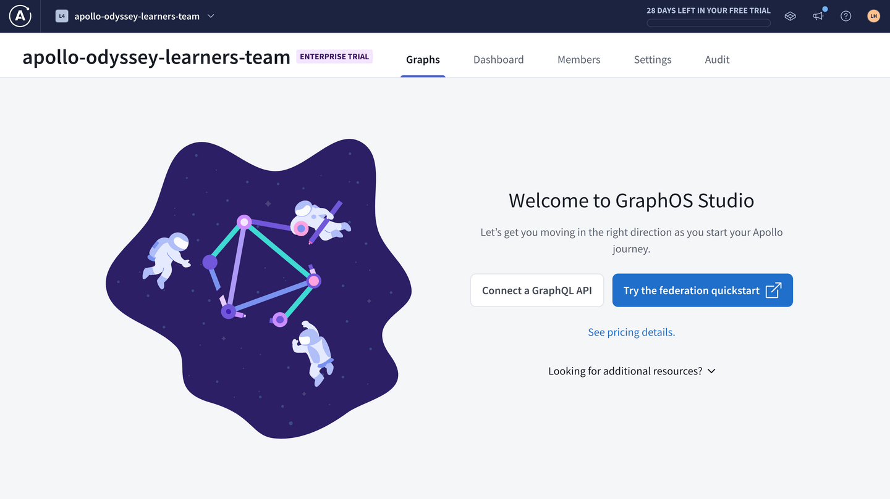
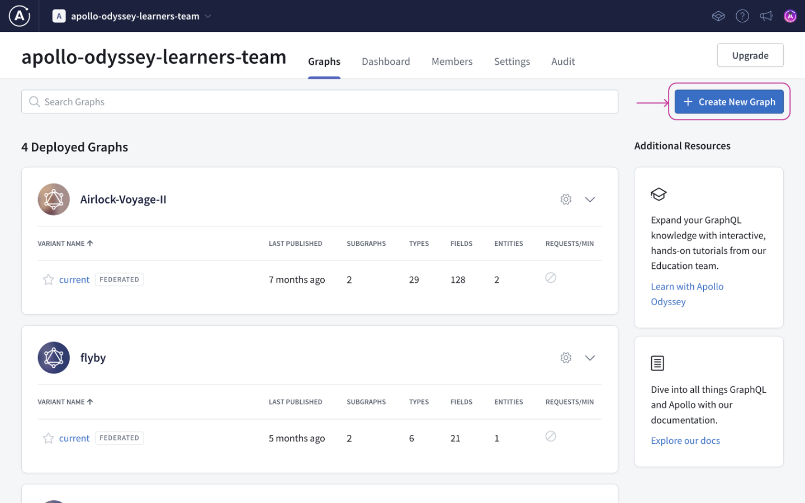
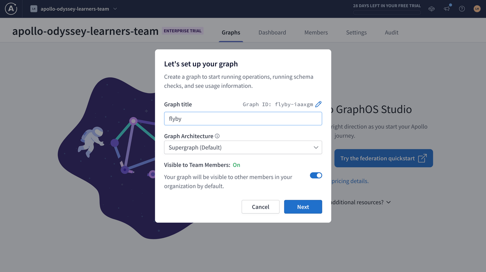
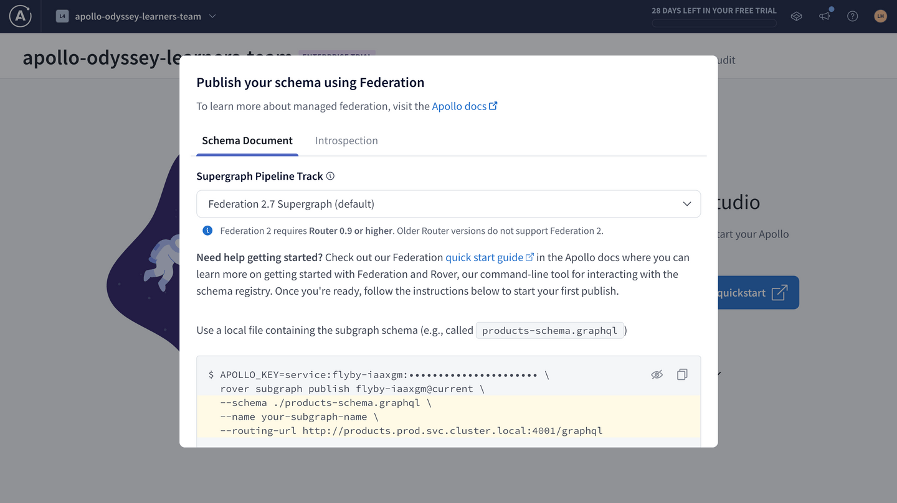
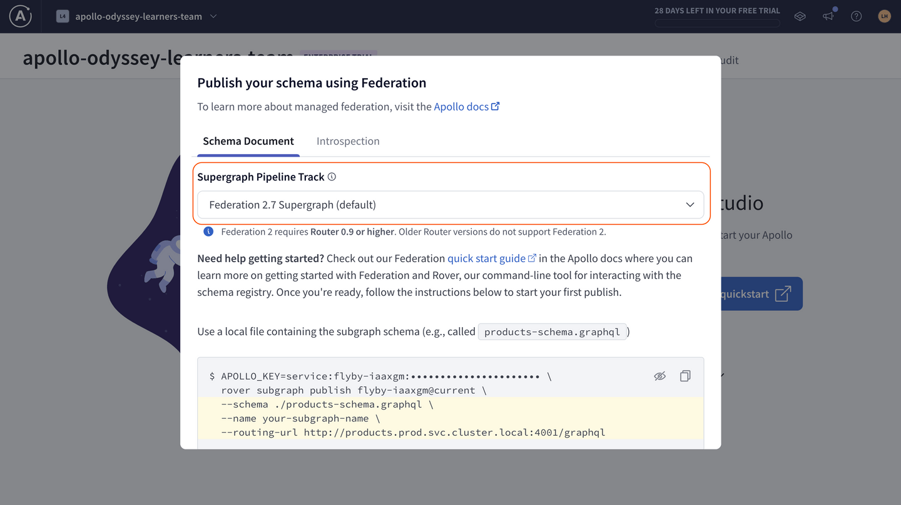
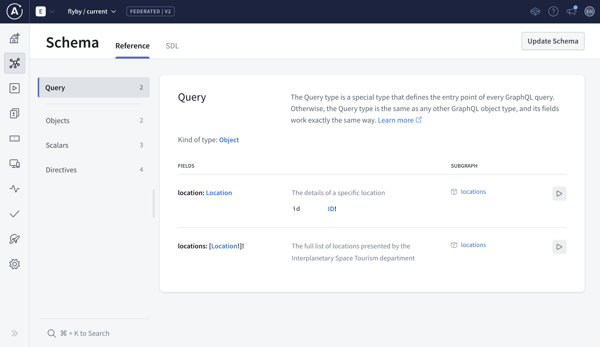
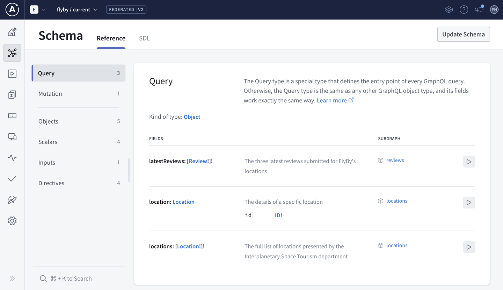
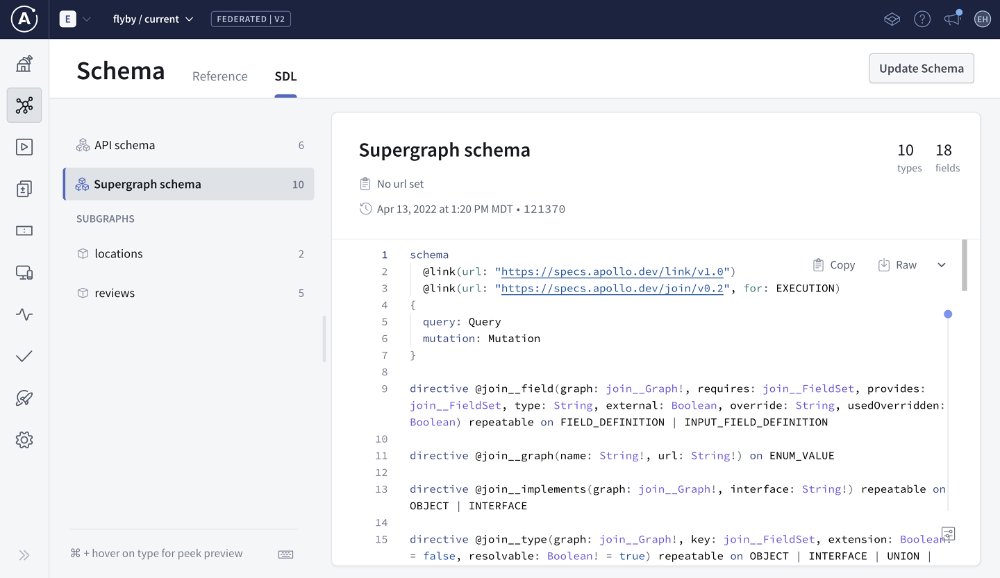

# Chapter 6: PUBLISHING THE SUBGRAPHS WITH ROVER

[Previous: Chapter 5](Voyage-part-1-chapter-5.md) | [Next: Chapter 7](Voyage-part-1-chapter-7.md)

### Overview

Now that we've seen what the full managed federation workflow looks like, it's time to pick up where we left off with FlyBy. We have our `locations` and `reviews` subgraphs in place, so the next steps are to create a supergraph in GraphOS Studio and publish our subgraphs!

In this lesson, we will:

- Create a supergraph for FlyBy in GraphOS Studio
- Use the Rover CLI to register our subgraph schemas with the schema registry
- Review the supergraph schema generated by the schema registry

### ✏️ Creating a graph in GraphOS Studio

Let's start by spinning up a new supergraph for FlyBy.

Open a new browser window and go to `GraphOS Studio` https://studio.apollographql.com/.



2. If you haven't created a graph in Studio before now, you'll can get started by clicking Connect a GraphQL API.

Otherwise, we can click the + Create New Graph button in the upper right corner of the Graphs tab.



3. We'll give our graph a descriptive title, keep the default settings for Graph Architecture as "Supergraph", then click Next.



If you don't see the modal above, you may be on the wrong plan.

4. We should now see a modal with options for publishing a schema.



We'll get to that in a moment.

### ✏️ Storing GraphOS environment variables

To publish our subgraphs using Rover, we'll need to save two environment variables from Studio:

- `APOLLO_KEY`: An API key for authenticating Rover. It starts with something like `service:your-graph-name`.
- `APOLLO_GRAPH_REF`: The graph reference (or graph ref) for our supergraph, which we'll use to tell Rover where to publish our subgraphs.

  - A graph ref starts with the graph's ID, followed by an @ symbol, followed by the graph variant.

We can get the values for `APOLLO_KEY` and `APOLLO_GRAPH_REF` out of the publishing options modal in Studio.

1. Go back to the configuration options in Studio that appeared after you created your supergraph. Make sure you're on the Schema Document tab.

2. First, make sure that the Supergraph Pipeline Track dropdown is set to Federation 2.7 Supergraph. This specifies that our supergraph should be built using the latest features of Apollo Federation.



3. Below, take a little peek at the command for publishing a subgraph schema. We'll be running this command shortly, but for now, we're more interested in the `APOLLO_KEY` environment variable here.

```js
APOLLO_KEY=your-graphs-apollo-key \
  rover subgraph publish your-graph-name@current \
  --name products --schema ./products-schema.graphql \
  --routing-url http://products.prod.svc.cluster.local:4001/graphql
```

4. Click on the eye icon on the code block to reveal the full value of `APOLLO_KEY`. Copy `APOLLO_KEY` and its value to your clipboard.

5. Back in our code editor, we'll create a new file in the `router` directory called `.env`.

6. Paste your `APOLLO_KEY` into `router/.env`.

```
router/.env
```

```js
APOLLO_KEY = your - graphs - apollo - key;
```

7. Now let's go back to Studio to get our graph ref. The value we're looking for appears in the same code block, directly after the "rover subgraph publish" part of the command. We'll copy this value onto our clipboard.

```js
APOLLO_KEY=your-graphs-apollo-key \
  rover subgraph publish your-graph-name@current \
  --name products --schema ./products-schema.graphql \
  --routing-url http://products.prod.svc.cluster.local:4001/graphql
```

> **Note**: Our graph ref uses the `current` variant for our supergraph, which is the default variant. We'll talk more about variants in Voyage III: Federation in Production.

8. In your `router/.env` file, add a new line and set your `APOLLO_GRAPH_REF` environment variable:

```
router/.env
```

```js
APOLLO_KEY=your-graphs-apollo-key
APOLLO_GRAPH_REF=your-graph-name@current # highlight-line
```

> Warning: For security, environment variables should never be committed to version control. For this reason, this project includes a `.gitignore` file which specifies that the `.env` file should be ignored when committing code changes to a repository.

We've got the values we need to publish our subgraphs!

### The `rover subgraph publish` command

Rover has a command ready to help us with this important task: rover subgraph publish. This command pushes the latest version of a single subgraph schema to GraphOS.

```js
rover subgraph publish <APOLLO_GRAPH_REF> \
  --name <SUBGRAPH NAME> \
  --schema <SCHEMA FILE PATH> \
  --routing-url <ROUTING URL>
```

To use this command, we need the graph ref for the supergraph we want to publish to and the following command line options:

| Option          | What is it?                                        |
| --------------- | -------------------------------------------------- |
| `--name`        | What we want to call our subgraph in GraphOS       |
| `--schema`      | The relative path to our subgraph's schema file    |
| `--routing-url` | The URL where our subgraph runs (locally, for now) |

We'll fill in these options with the details for each of our subgraphs.

### ✏️ Publishing the `locations` subgraph

Let's see this command in action by publishing our `locations` subgraph.

1. Bounce back to the terminal and make sure we're in the root directory for the project.

2. Now let's type out the `rover subgraph publish` command:

We'll paste in the value of our `APOLLO_GRAPH_REF` environment variable.

For the `name` option, we'll pass in `locations`.

For the `schema` option, we'll pass the relative path to our `locations.graphql` file.

And for the `routing-url` option, we'll pass in `localhost:4001`.

```js
rover subgraph publish <APOLLO_GRAPH_REF> \
  --name locations \
  --schema ./subgraph-locations/locations.graphql \
  --routing-url http://localhost:4001
```

> `Note`: We've used the `\` character in this command to improve legibility by putting each command-line option on its own line. If you choose to type the entire `rover subgraph publish` command on a single line, you don't need to include the `\`.

3. After running the command, you'll see the following message:

```
The host `localhost` is not routable via the public internet.
Continuing the publish will make this subgraph reachable in local environments only.
Would you still like to publish? [y/N]
```

Type in y to allow it. We're in tutorial land and working in local environments for now!

Note that you'll need to do this after every subgraph schema publish command.

4. If all is well in the world, running this command should output a message confirming that the subgraph has been published and the supergraph has been updated!

### Checking the results in Studio

Let's go back to Studio and have a look at "See schema changes" to see what's changed in our supergraph.

This new page looks similar to the Sandbox we used in previous lessons, but with additional features for managing our supergraph.

Let's click on the Schema tab in the sidebar.

#### Schema Reference

The Schema Reference page lets us see all the types and fields in our composed supergraph schema. That's right, even though we've only published one subgraph so far, we already have a supergraph schema!

We see that our supergraph's `Query` type includes the two fields from the `locations` subgraph. Each field is annotated with its description, any variables it requires, and which subgraph it belongs to.



### Publishing the `reviews` subgraph

Let's use `rover subgraph publish` again to publish the `reviews` subgraph and see how our schema changes.

1. Back in the terminal in the root of our project, we'll use the `rover subgraph publish` command again. We won't change our graph ref, but we'll update the other command line options to reflect the `reviews` subgraph:

```js
rover subgraph publish <APOLLO_GRAPH_REF> \
  --name reviews \
  --schema ./subgraph-reviews/reviews.graphql \
  --routing-url http://localhost:4002
```

2. After it runs successfully, head back to Studio and refresh the Schema Reference page. Now we can see the new `latestReviews` field that our `reviews` subgraph added to the `Query` type!



Nice job! With just a few commands, we've reached an important milestone on our federation journey. We've used managed federation to register our subgraphs to the schema registry, and GraphOS automatically composed our supergraph schema for us!

### Reviewing our schemas

Let's take a closer look at that supergraph schema. Click on the SDL tab at the top of the Schema page. Here we can see details about our published subgraphs, along with two additional schemas.

The API schema is the GraphQL API that gets exposed to your clients. It cleanly and logically represents the combination of your subgraph schemas. (We won't worry about this schema for now.)

The Supergraph schema is used by the router like a map, to define how incoming GraphQL operations can be divided up among the underlying subgraphs. Let's investigate the Supergraph schema to get an idea of what GraphOS is doing for us behind the scenes.



Looks like the supergraph schema includes some new syntax and directives that we didn't create ourselves. We don't need to dive into these. But what's more interesting to us is seeing how the supergraph schema identifies the types and fields that belong to each one of our subgraphs.

Scroll down in the supergraph schema and take a look at the `Query` type. Here, the fields we added to the `Query` type in both subgraphs have been consolidated in one place. Each field is annotated with a special `@join_field` directive that references the name of its originating subgraph.

```graphql
type Query @join__type(graph: LOCATIONS) @join__type(graph: REVIEWS) {
  """
  The full list of locations presented by the Interplanetary Space Tourism department
  """
  locations: [Location!]! @join__field(graph: LOCATIONS)

  """
  The details of a specific location
  """
  location(id: ID!): Location @join__field(graph: LOCATIONS)

  """
  The three latest reviews submitted for FlyBy's locations
  """
  latestReviews: [Review!]! @join__field(graph: REVIEWS)
}
```

Our supergraph schema provides a complete picture for the router to query for information about locations, reviews, or any combination of the two! And as we learned in the previous lesson, GraphOS will automatically recompose this supergraph schema anytime we push a change to either one of our subgraphs.

### Key takeaways

- We can use the `rover subgraph publish` command from the Rover CLI to publish our subgraph schemas to the Apollo schema registry.
- Whenever a new subgraph schema is published, GraphOS composes a new supergraph schema with any subgraphs registered to our supergraph.
- The supergraph schema consolidates all the types and fields across our published subgraphs. It also includes extra directives to help the router determine which subgraphs can resolve each field.

[Previous: Chapter 5](Voyage-part-1-chapter-5.md) | [Next: Chapter 7](Voyage-part-1-chapter-7.md)
