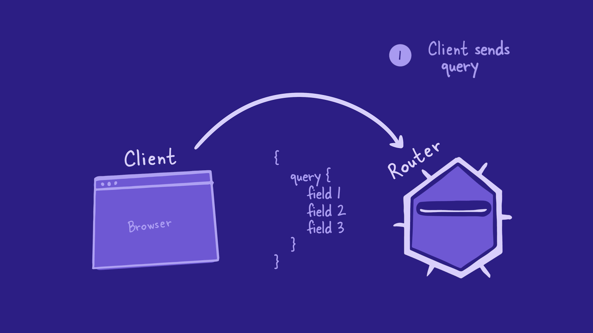
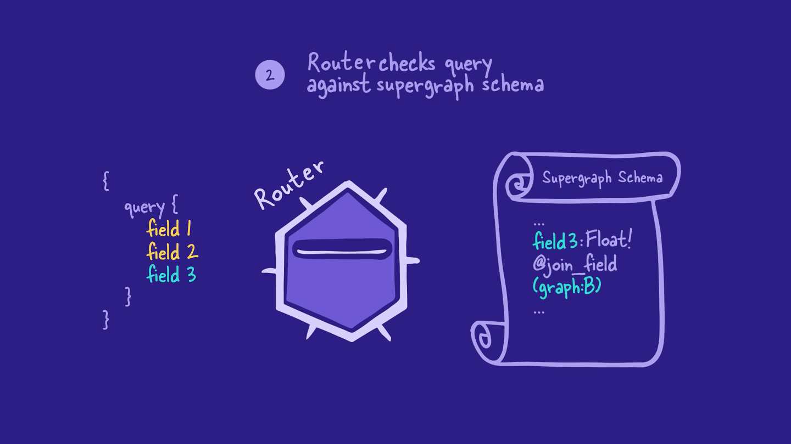
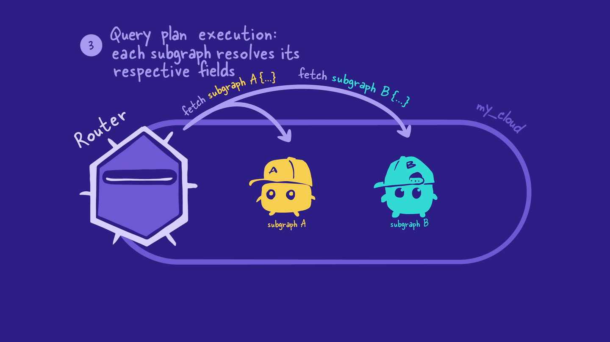
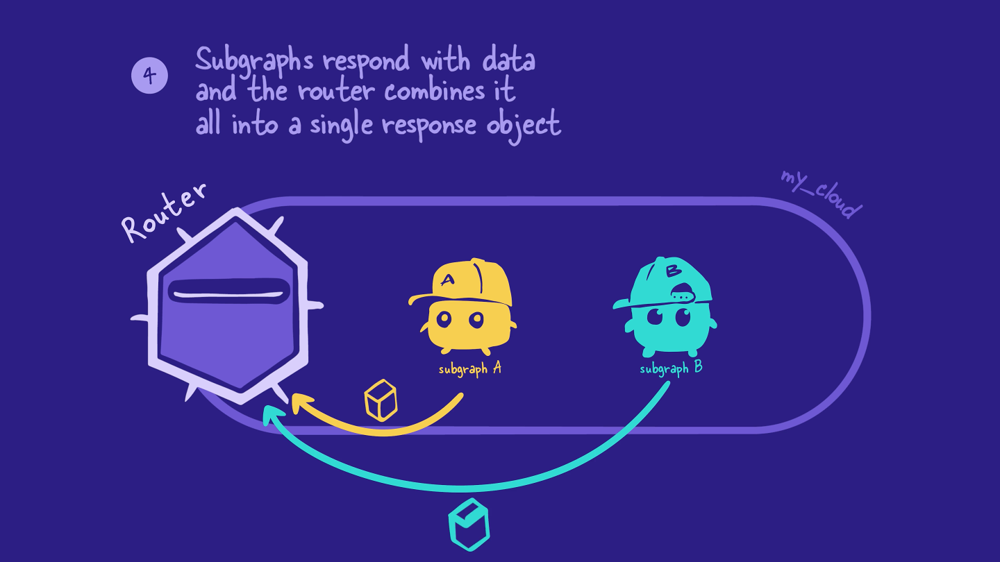
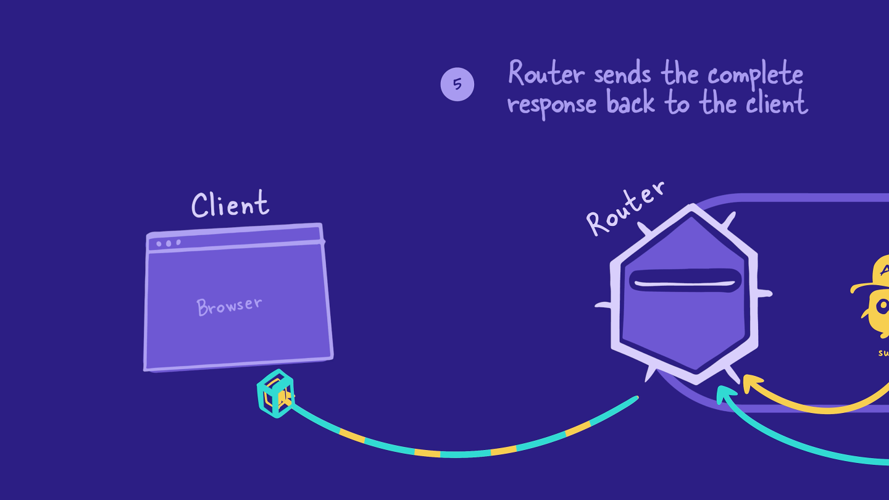
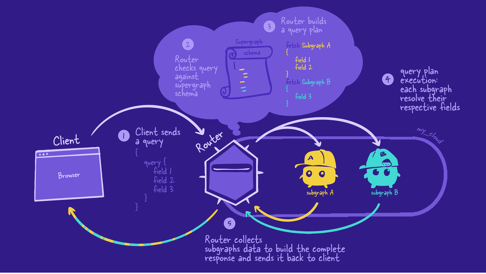

# Chapter 7: How the Router Resolves Data

[Previous: Chapter 6](Voyage-part-1-chapter-6.md) | [Next: Chapter 8](Voyage-part-1-chapter-8.md)

### Overview

So far, we've mainly been focused on our subgraphs. Now it's router time!

We know that the router uses the supergraph schema to resolve incoming GraphQL operations from the client. But how exactly does that process work?

In this lesson, we will:

- Trace the journey of a client request through the supergraph
- Describe how the router creates query plans to resolve GraphQL operations across multiple subgraphs

### The journey of a GraphQL operation through the supergraph

Let's start at the beginning: from the client request.

## Step 1: The client request

First, the client sends a GraphQL operation to the router. The client has no clue which fields belong to which subgraphs—or even that there are subgraphs at all!

## Step 2: Building a query plan

Router checks query against supergraph schema

It uses this information to build a query plan, a list of smaller GraphQL operations to execute on the subgraphs. The query plan also specifies the order in which the subgraph operations need to run.

## Step 3: Executing the query plan

Next, the router carries out the query plan by sending the smaller GraphQL operations to each of the subgraphs it needs data from.

The subgraphs resolve the operations the same way as any other GraphQL server: they use their resolvers and data sources to retrieve and populate the requested data.

## Step 4: The subgraph responses

The subgraphs send back the requested data to the router, and then the router combines all those responses into a single JSON object.

## Step 5: Sending data back to the client

Finally, the router sends the final JSON object back to the client. And that's the end of our operation's journey!

## Recap

Here's the entire journey of a GraphQL operation through the supergraph, summarized in a single diagram:

## Key takeaways

- The router uses the supergraph schema to create a query plan for the incoming GraphQL operation. The query plan is a list of smaller operations the router can execute on different subgraphs to fully resolve the incoming operation.
- The router carries out the query plan by executing the list of operations on the appropriate subgraphs.
- The router combines all the responses from the subgraphs into a single JSON object, which it sends back to the client.

[Previous: Chapter 6](Voyage-part-1-chapter-6.md) | [Next: Chapter 8](Voyage-part-1-chapter-8.md)
