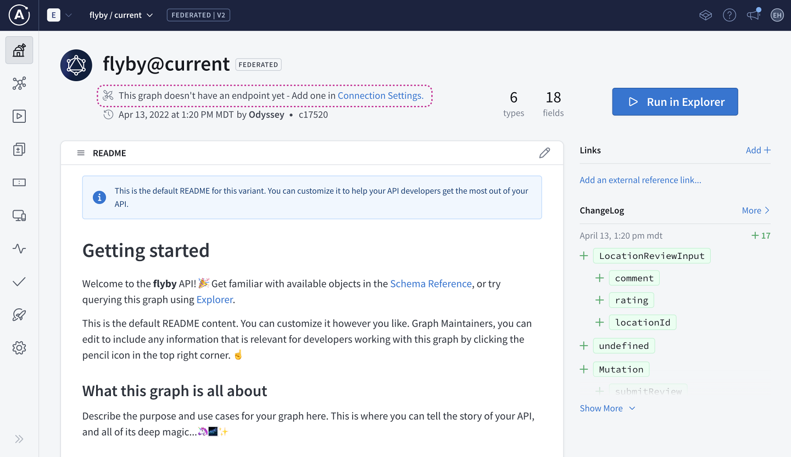
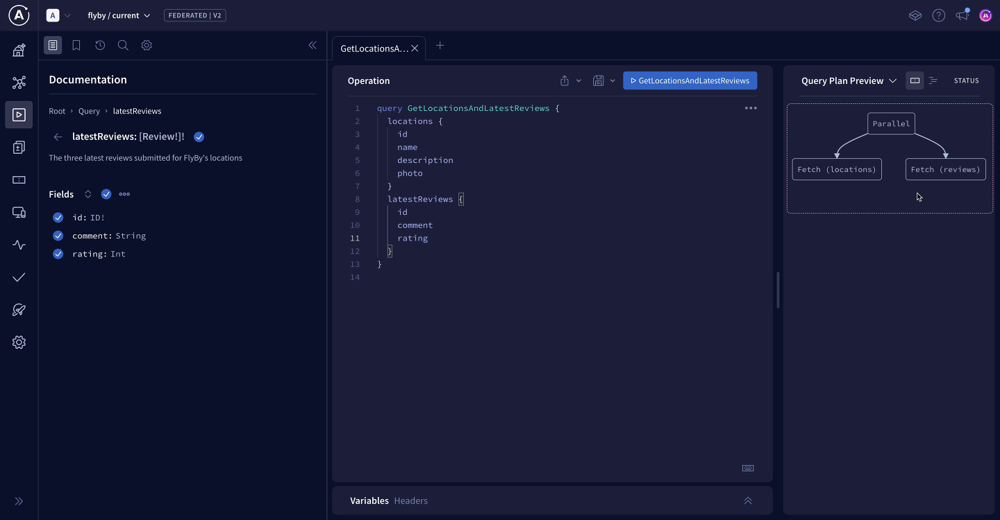
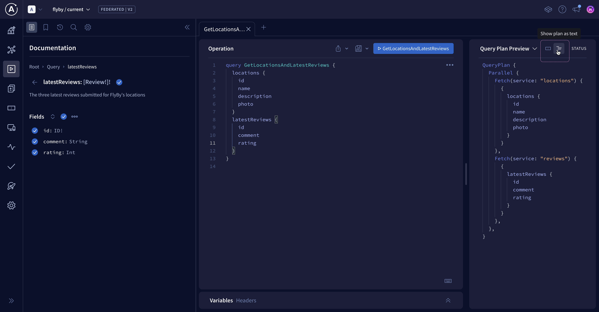
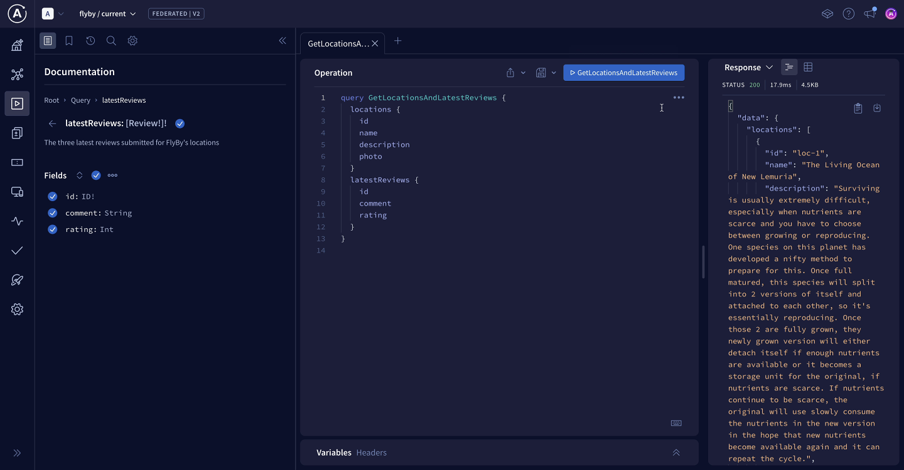

# Chapter 8: Router Configuration and Uplink

[Previous: Chapter 7](Voyage-part-1-chapter-7.md) | [Next: Chapter 9](Voyage-part-1-chapter-9.md)

### Overview

> So far, FlyBy's subgraphs are running and their schemas have been published, but we still need one piece to tie everything together: the router.

In this lesson, we will:

- Set up the GraphOS Router locally
- Connect the router to GraphOS
- Send our first query to our supergraph

### Downloading the router

The GraphOS Router is a high-performance graph router available as an executable binary that you can add to your project in a few steps:

1. Open a terminal window and navigate to the router directory in the FlyBy project.

`cd router`

So far, we only have the `.env` file in here with our environment variables.

> 📦 router<br>
> ┣ 📄 .env

2. We'll download the Router by running the install command in the terminal.

`curl -sSL https://router.apollo.dev/download/nix/v1.46.0 | sh`

3. Now when we check the contents of our router directory, we'll see that we have a new file also called router!

> 📦 router<br>
> ┣ 📄 .env<br>
> ┗ 📄 router

### ✏️ Running the router

1. Back in the same terminal window, run the command below. You'll need to replace the <APOLLO_KEY> and <APOLLO_GRAPH_REF> placeholder values with your supergraph's corresponding values from the router/.env file. This command starts up the router locally and tells the router which supergraph to connect to.

`APOLLO_KEY=<APOLLO_KEY> APOLLO_GRAPH_REF=<APOLLO_GRAPH_REF> ./router`

2. We'll see a few lines of router output, and finally a message that our router is running on port 4000, ready to receive queries!

Let's copy this address, we'll need it to set our connection settings in Studio. This tells outside consumers of our API what endpoint they can use to query our schema.

`GraphQL endpoint exposed at http://127.0.0.1:4000/ 🚀`+

### ✏️ Connecting the router to GraphOS

Let's flip back over to Studio.

1. Click on the README tab in the sidebar.

2. Next, tap the Connection Settings link at the top of the page.



3. We'll paste the router address we copied (http://127.0.0.1:4000) as the endpoint, then save.


Let's get to querying our supergraph!

### ✏️ Testing our schema

1. Select the Explorer tab from the sidebar.

2. Let's put together a query that retrieves data from both of our subgraphs. We'll call our query `GetLocationsAndLatestReviews`.

3. Now let's fire in some fields. We'll start with `locations`. Click the plus button (⊕) next to Fields to add all the location fields to our query.

Next let's go back and add `latestReviews`, and all the reviews subfields.

Our query should look like this:

```graphql
query GetLocationsAndLatestReviews {
  locations {
    id
    name
    description
    photo
  }
  latestReviews {
    id
    comment
    rating
  }
}
```

4. Before we run the query, let's change the Response dropdown on the right to Query Plan Preview. This shows us a diagram for the query plan the router will use to resolve our current operation.



5. By choosing the icon to Show plan as text, we'll see a more detailed breakdown of the query plan. We won't worry about all the syntax here, but we can get a general idea of how the router plans to handle this query: the `locations` subgraph will resolve the `locations` fields, and the `reviews` subgraph will handle `latestReviews` and its subfields.



6. Now let's run this query.



### JSON response

```json
{
  "data": {
    "locations": [
      {
        "id": "loc-1",
        "name": "The Living Ocean of New Lemuria",
        "description": "Surviving is usually extremely difficult, especially when nutrients are scarce and you have to choose between growing or reproducing. One species on this planet has developed a nifty method to prepare for this. Once full matured, this species will split into 2 versions of itself and attached to each other, so it's essentially reproducing. Once those 2 are fully grown, they newly grown version will either detach itself if enough nutrients are available or it becomes a storage unit for the original, if nutrients are scarce. If nutrients continue to be scarce, the original will use slowly consume the nutrients in the new version in the hope that new nutrients become available again and it can repeat the cycle.",
        "photo": "https://res.cloudinary.com/apollographql/image/upload/v1644381344/odyssey/federation-course1/FlyBy%20illustrations/Landscape_4_lkmvlw.png"
      },
      {
        "id": "loc-2",
        "name": "Vinci",
        "description": "Many of the creatures on this planet have evolved into gliders, so to speak. Most of the fish and aquatic mammals, despite coming in various shapes and sizes, tend to glide through the water without effort, similar to how manta's glide on Earth. However, the surface species are more astonishing. Similar to the flying squirrels or the vultures of Earth, many of the species on this planet have developed ways to effortlessly move from one place to another by using the winds. But there is one species which shows signs of sentience. These species, a type of bird, love to play and have become masters of flight. Similar to how dolphins play, explore and learn, these species use their intellect and courage to play and sometimes challenge each other to death defying tricks.",
        "photo": "https://res.cloudinary.com/apollographql/image/upload/v1644381349/odyssey/federation-course1/FlyBy%20illustrations/Landscape_15_tiqel5.png"
      },
      {
        "id": "loc-3",
        "name": "Asteroid B-612",
        "description": "Nutrients are always needed but not always around, so organisms have to find ways to get them. Common ways are using different roots to find them in deep or shallow grounds or even stealing them from others, but on this planet many species have found a different balance. Unlike most plants on Earth who tend to only produce oxygen and nutrients, usually in the form of sugars, for itself, the organisms on this planet also produce other forms of nutrients for itself, usually for different purposes. These processes often lead to many byproducts which it doesn't need and are thus discarded. These discarded products are exactly what other species need to live and in turn produce byproducts it discards for the other organisms, leading to a delicate balance.",
        "photo": "https://res.cloudinary.com/apollographql/image/upload/v1644381343/odyssey/federation-course1/FlyBy%20illustrations/Landscape_6_vt6y3v.png"
      },
      {
        "id": "loc-4",
        "name": "Krypton",
        "description": "Similar to the surface, the underwater world has little more to offer than basic lifeforms. However, this planet has an astonishing water world. Almost everything is covered in a type of sea-grass. This grass varies in length depending on the region, but they're all part of the same species. But what's probably more surprising are the 'flowers' you'll find in these fields of sea-grass. These flowers can only be described as primitive soft corals, but they're neither coral nor plant.",
        "photo": "https://res.cloudinary.com/apollographql/image/upload/v1644381344/odyssey/federation-course1/FlyBy%20illustrations/Landscape_9_kbenjj.png"
      },
      {
        "id": "loc-5",
        "name": "Zenn-la",
        "description": "The plant-like organisms on this planet are made up of millions of flowers. Their combined colors and scents make for an amazing spectacle, but they leave little space for other species, which is why there are only very few bush and shrub species. Fungi, grasses and trees are non-existent.",
        "photo": "https://res.cloudinary.com/apollographql/image/upload/v1644381346/odyssey/federation-course1/FlyBy%20illustrations/Landscape_8_zd1e68.png"
      }
    ],
    "latestReviews": [
      {
        "id": "rev-8",
        "comment": "This is simply unbelievable! It's the perfect solution for our business. Really good. I don't always clop, but when I do, it's because of planet",
        "rating": 5
      },
      {
        "id": "rev-9",
        "comment": "Planet is exactly what our business has been lacking. It's incredible. If you want real marketing that works and effective implementation - planet's got you covered.",
        "rating": 5
      },
      {
        "id": "rev-10",
        "comment": "Thanks planet! I was amazed at the quality of planet. Planet did exactly what you said it does.",
        "rating": 5
      }
    ]
  }
}
```

> Fantastic! We can see that the `data` object in our response contains both locations and reviews.

> This is huge. We've just unlocked one of the powers of our supergraph: we can write one query to our router and hit both subgraphs at once!

### Key takeaways

The GraphOS Router is an executable binary file that can be downloaded and run locally.
The Query Plan Preview inspects the GraphQL operation in the Explorer and outputs the query plan the router will execute to resolve the operation.

[Previous: Chapter 7](Voyage-part-1-chapter-7.md) | [Next: Chapter 9](Voyage-part-1-chapter-9.md)
