# Chapter 9: Connecting Data Using Entities

[Previous: Chapter 8](Voyage-part-1-chapter-8.md) | [Next: Chapter 10](Voyage-part-1-chapter-10.md)

### Overview

> The foundation of our supergraph is complete. We've separated FlyBy's schema into location data and review data, and we've implemented subgraphs that only define the types they're concerned with.

Revisiting our schema agreement checklist, we still have three fields that we don't know how to implement yet:

- `Location.reviewsForLocation` and `Location.overallRating`: These are both fields of the `Location` type, but we decided we want them to be owned by the `reviews` subgraph.
- `Review.location`: This is a field on the `Review` type (which lives in the `reviews` subgraph), but the field has a return type of `Location`, which is defined in the `locations` subgraph.

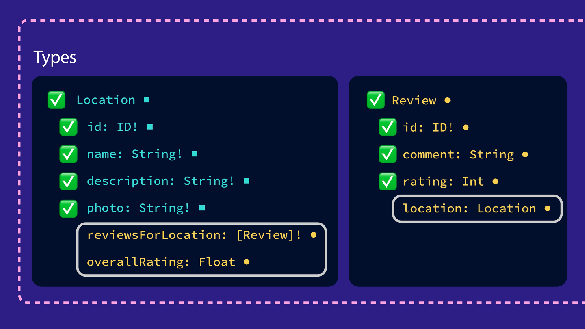

To implement these fields, we need to add a new tool to our developer tool belts: entities!

In this lesson, we will:

- Learn what an entity is and what it's used for
- Learn how to define an entity
- Learn how the router represents entities when it talks between subgraphs

### What's an entity?

An _entity_ is an object type with fields split between multiple subgraphs.

This means we can define a type that both of our subgraphs can contribute fields to and resolve independently.

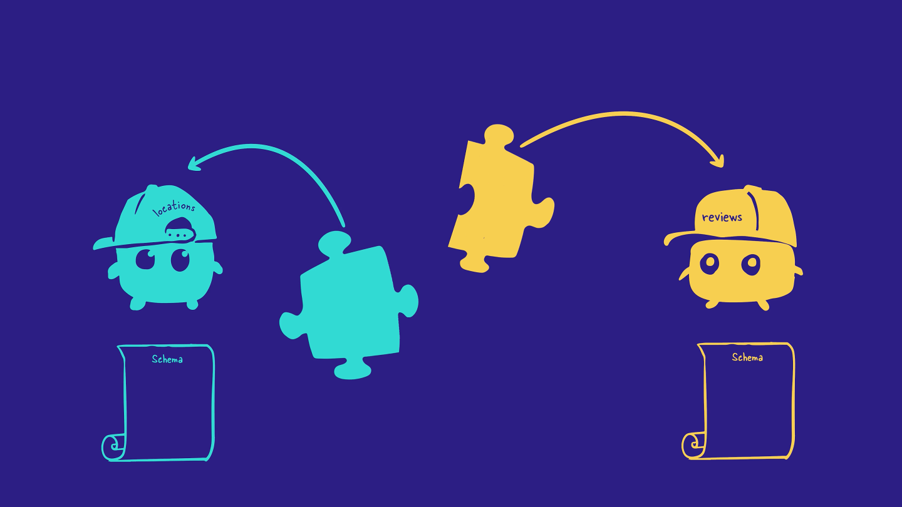

In FlyBy, we want our `reviews` to include the `location` that they are written about. Our `Location` type needs to be used by both subgraphs, so we'll be turning the `Location` type into an _entity_.

A subgraph that defines an _entity_ can do one or both of the following:

1. Reference the entity
2. Contribute fields to the entity

### Reference the entity

Referencing an _entity_ means using it as a return type for another field defined in the subgraph.

For example, in the `reviews` subgraph, we can add a `location` field to the `Review` type, which will reference the `Location` _entity_ as its return type.

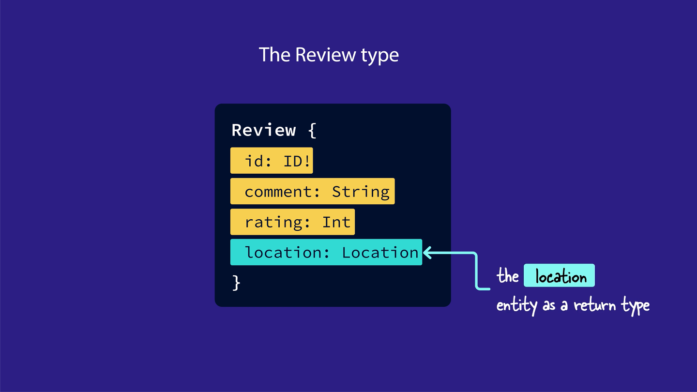

### Contribute fields to the entity

Contributing fields to an entity means that one subgraph adds new fields to an entity that are specific to that subgraph's concerns.

For example, the `Location` entity will have fields for name, description, and photo, which will live in the `locations` subgraph. In other words, the `locations` subgraph contributes these fields to the `Location` entity.

And the `reviews` subgraph contributes two review-specific fields to the `Location` entity: `reviewsForLocation` and `overallRating`.

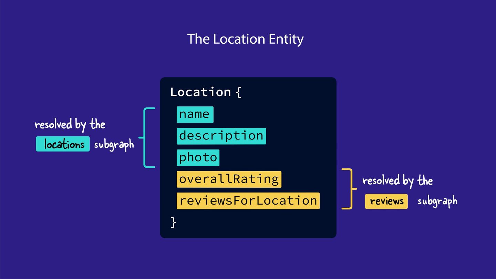

## How to create an entity

To convert an object into an entity in the subgraph schema, we need to do two things:

1. Define a primary key
2. Define a reference resolver

### Defining a primary key

An entity's primary key is the field (or fields) that can uniquely identify an instance of that entity within a subgraph. The router uses primary keys to collect data from across multiple subgraphs and associate it with a single entity instance.

For example, a location entity's primary key is its id. The router uses that id to collect data about a specific location instance, like a location with id "loc-1".

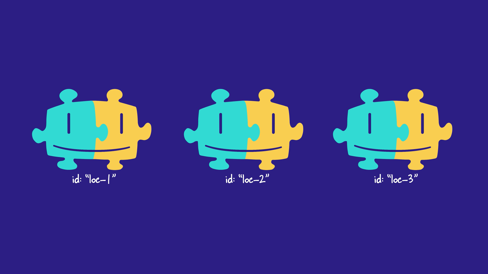

In each of our subgraph schemas, we can define a primary key for an entity, by adding the `@key` directive after the type's name.

The `@key` directive needs a property called `fields`, which we'll set to the field we want to use as the entity's primary key.

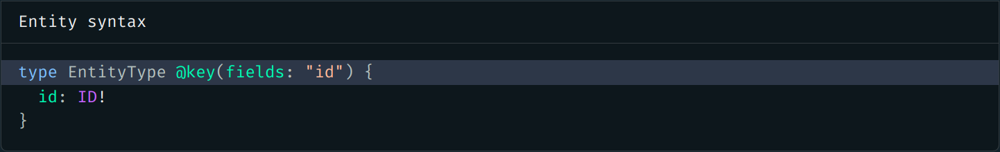

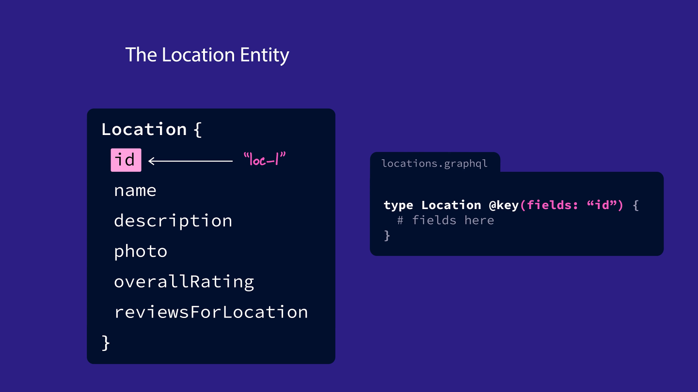

## Defining a reference resolver function

Each subgraph that contributes fields to an entity also needs to define a special resolver function for that entity called a `reference resolver`. The router uses `reference resolver` to directly access the entity fields that each subgraph contributes.

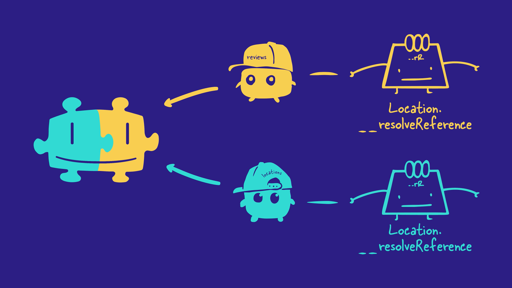

Every reference resolver has the name: `__resolveReference`. We define each entity's reference resolver right alongside all the field resolvers for that type.

The `__resolveReference` function has a slightly different signature from other resolver functions. Instead of the usual four arguments, `__resolveReference` only takes three:

- `reference`: The entity representation object that's passed in by the router. This tells the subgraph which instance of an entity is being requested. We'll cover what an entity representation is in the section below.
- `context`: The object shared across all resolvers. (This is the same as in normal resolvers, but note that by convention, we refer to this `__resolveReference` argument as `context`, rather than `contextValue` as in other resolvers!)
- `info`: Contains information about the operation's execution state, just like in a normal resolver. We won't use this argument much.

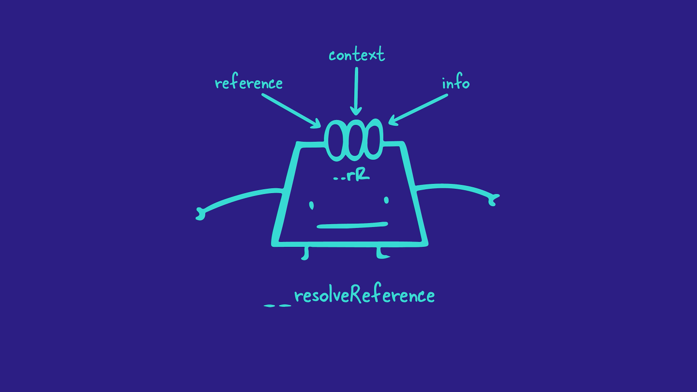

Let's focus on this first argument, `reference`, and learn more about entity representations.

### What's an entity representation?

An `entity representation` is an object that the router uses to represent a specific instance of an entity. A representation always includes the `typename` for that entity and the `@key` field for the specific instance.

- The `__typename` field: This field exists on all GraphQL types automatically. It always returns the name of its containing type, as a string. For example, `Location.__typename` returns
  "Location".
- The `@key` field: The key-value pair that a subgraph can use to identify the instance of an entity. For example, if we defined the `Location` entity using the "id" field as a primary key, then our entity representation would include an "id" property with a value like "loc-2".

An entity representation for a location might look like this:

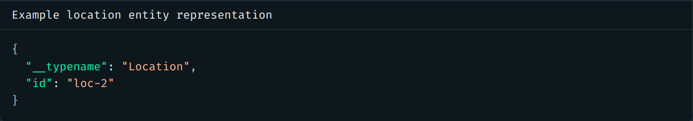

You can think of an entity representation as a passport that the router uses to refer to a particular object between subgraphs.

The typename field is like a passport's country of origin. It says which entity the object belongs to. And the `@key` field is like a passport's ID number, uniquely identifying this instance of that entity.

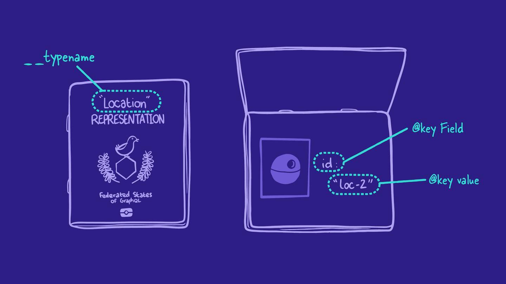

### Key takeaways

- An entity is a type that can resolve its fields across multiple subgraphs.
- To create an entity, we can use the `@key` directive to specify which field(s) can uniquely identify an object of that type.
- We can use entities in two ways:
  - As a return type for a field (referencing an entity).
  - Defining fields for an entity from multiple subgraphs (contributing to an entity).

* Any subgraph that contributes fields to an entity needs to define a reference resolver function for that entity. This `__resolveReference` resolver is called whenever the router needs to access fields of the entity from within another subgraph.
* An entity representation is an object that the router uses to represent a specific instance of an entity. It includes the entity's type and its key field(s).

[Previous: Chapter 8](Voyage-part-1-chapter-8.md) | [Next: Chapter 10](Voyage-part-1-chapter-10.md)
