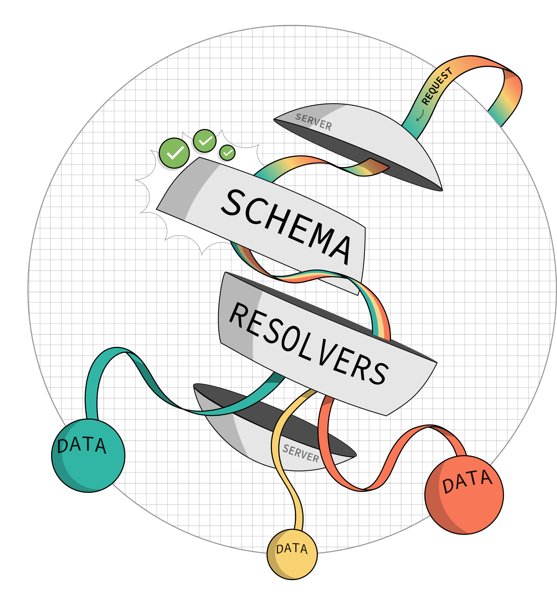

# Dictionary of Apollo Terms

## Terms

- [Apollo Client](#apollo-client)
- [Apollo Federation](#apollo-federation)
- [Apollo Gateway](#apollo-gateway)
- [Apollo Server](#apollo-server)
- [Entities in Apollo Federation](#entities-in-apollo-federation)
- [Operations](#operations)
- [GraphQL](#graphql)
- [Subgraph](#subgraph)
- [Supergraph](#supergraph)
- [GraphQL Server](#graphql-server)
- [GraphQL Schema](#graphql-schema)

## Full Descriptions

### Apollo Client

Apollo Client is a comprehensive state management library for JavaScript that enables you to manage both local and remote data with GraphQL. It helps you fetch, cache, and modify application data, all while automatically updating your UI.

---

### Apollo Federation

Apollo Federation is a powerful, open architecture for creating a unified supergraph that combines multiple GraphQL APIs into a single endpoint. It allows teams to work independently on different parts of a schema while maintaining a consistent API.

---

### Apollo Gateway

Apollo Gateway is the runtime engine that composes the supergraph from multiple subgraphs in a federated architecture. It provides a single entry point for client requests and forwards them to the appropriate subgraph services.

---

### Apollo Server

Apollo Server is an open-source, spec-compliant GraphQL server that's compatible with any GraphQL client, including Apollo Client. It's the best way to build a production-ready, self-documenting GraphQL API that can use data from any source.

#### You can use Apollo Server as:

- A gateway for a federated supergraph
- The GraphQL server for a subgraph in a federated supergraph
- A stand-alone GraphQL server, including in a serverless environment
- An add-on to your application's existing Node.js middleware (such as Express or Fastify)

#### Apollo Server provides:

- Straightforward setup, so your client developers can start fetching data quickly

* Incremental adoption, allowing you to add features as they're needed
* Universal compatibility with any data source, any build tool, and any GraphQL client
* Production readiness, enabling you to ship features faster

---

### GraphQL

GraphQL is a query language for APIs and a runtime for executing those queries by using a type system you define for your data. It provides a more efficient, powerful, and flexible alternative to REST.

---

### Subgraph

A subgraph is an independent service in a federated architecture that has its own GraphQL schema. Subgraphs can be developed and maintained separately and then combined into a supergraph.

---

### Supergraph

A supergraph is a unified GraphQL schema composed of multiple subgraphs. It provides a single endpoint for client requests, allowing for a modular and scalable architecture.

---

### GraphQL Server

How does a GraphQL server work? What are the pieces that bring it to life?

If you go looking for the answer, chances are you'll quickly run into some unfamiliar terms: `schema, resolvers, data loaders`, to name a few.

#### An overview of the GraphQL server

Understanding "the GraphQL way" begins with the GraphQL server.

The server contains all the rules to decide if you're allowed to have what you're requesting. It knows how to locate all of the pieces of data that a request asks for. And its ability to traverse a graph of information from one object to the next means that your requests can be both complex and specific.

In short, it houses all of the pieces that make it possible for the server to:

1. Receive requests
2. Decide if they're valid
3. Retrieve the requested data
4. Return it all to the person that requested it

We can divide these capabilities across three different components: the schema, the resolvers, and the server that contains all the pieces.

#### The GraphQL server implementation

By itself, GraphQL is just a query language. With it, we can write really descriptive, easy-to-read queries that ask for everything that we want in one go. But in order to receive GraphQL queries, a server needs to have a mechanism to interpret GraphQL. Even though our requests have a slightly different format, this mechanism turns out to be the same piece that powers a web server: it's the component that listens for HTTP requests and has all the instructions to figure out how to fulfill them.

You can definitely build a GraphQL server from scratch—but fortunately, a lot of libraries out there provide out-of-the-box boilerplates that take care of the details for you.

Apollo Server is an open-source server library that's great for beginners and experts alike. It's quick and easy to set up, but robust enough to handle enterprise traffic either as a standalone server or part of a federated graph.

Apollo Server gives us a way to start listening for requests immediately. But to actually start querying our server for data, we need to hand it just a few missing pieces: some information about what can be queried, and the hookups for where to find that data. Next, let's talk about the document that details everything that can be queried—the schema.

---

### Entities in Apollo Federation

Entities are a fundamental building block of Apollo Federation. In a supergraph, an entity is an object type that can resolve its fields across multiple subgraphs. Each subgraph can contribute different fields to the entity and is responsible for resolving only the fields that it contributes. This enables subgraphs to adhere to the separation of concerns principle.

---

### GraphQL Schema

The schema is an all-important document for any GraphQL API; it's the illustrated guide to the objects of data in a server and how they relate to each other. There's no sensitive, live data here; just the basic skeleton of the shapes that the live data will conform to. (Think of a blueprint!) These structures are called types, and the details that belong to types are called fields. Together, types and fields let us represent the real objects that we work with, AND depict how they relate to other types.

Three separate types, such as a User type, an Order type, and a Product type, might have relationships that we want to represent. The way we can lay out types in a GraphQL schema lets us immediately visualize these relationships and communicate that users have orders, and orders have products.

These relationships, which let us hop from one object to another, show the graph at work. The schema documents all of these connections, along with the characteristics for each object—we might, for instance, be able to ask for a user's name and email, an order's total dollar amount, and a product's country of origin. Plugged together, we can ask for all of these data points all at once—without sending a bunch of follow-up requests to assemble the pieces.

Furthermore, the schema acts as a kind of checkpoint. It's used to validate whether the requests our server receives are accurate and processable. If our schema contains information about users, orders, and products, for example, a request seeking student and course data will throw an error—the schema doesn't reflect these types, so the request can't proceed. The same is true if we ask for a type that exists, and a field that doesn't. The schema helps enforce that requests can only ask about the types and fields that we've previously defined.

When a request passes the checkpoint (that is, it contains only valid types and fields according to the schema), it proceeds to the next layer of our server: the resolver functions.

---

### The GraphQL resolver functions

How can a GraphQL server resolve data from multiple sources all at once, where a REST API might require multiple calls to different endpoints?

For every type and field in the GraphQL schema, we can define what's called a resolver function. This is a single operation that can retrieve the data for a specific field. This means that these functions have access to various data sources: databases, APIs, even text files or JSON!

Resolvers give a GraphQL server the flexibility to fulfill requests of different shapes and sizes. The way that we request data doesn't have to conform to a rigid pattern; we can mix and match the things we ask for, which gives us the precision to ask for exactly the data we need on a page-by-page or component-by-component basis. It all depends on what we want to do with the data!

Resolvers for fields in our schema are defined in a resolvers map, and they follow the hierarchy of the schema. This means that resolver functions for the name and email fields on a User type are nested under a specific User property that corresponds to that type. This keeps our resolver functions just as organized as our schema.

Resolvers also have a special function when it comes to authorization and authentication. It's here where the data is resolved that we can determine some of the logic around who's allowed to have it. Resolvers have access to a lot of the information that comes in as a request to our server, which enables them to make decisions about what they return on a request-by-request basis.

To keep our server lean and performant, resolver functions should be as focused as possible. By defining them on a field by field basis, we can identify the very specific logic that makes fulfilling a single field possible—resulting in the recombinability of fields from request to request that we mentioned earlier.

#### Data: the missing piece

There's an additional piece that we haven't addressed directly: what about the data that our resolver functions retrieve? Does it all need to live within the GraphQL server in order to be served up to a client?

Well, it CAN—but it definitely doesn't NEED to! One of GraphQL's greatest strengths is its ability to grab, collect, and serve up data from a variety of sources. As a result, there's no requirement to tear down existing databases or APIs in order to retrofit them for GraphQL—all we have to do is tell our server about them.

Returning to our Apollo Server example, we can achieve this by configuring data sources in our server. These are properties that we define on our server instance, and they contain all of the details and logic for how to access data—like a manual or instruction booklet for each place our GraphQL server will ask for data.

So, how we configure each data source depends on what it is and the kind of data it serves up: if we're connecting to a database, our configuration could include the connection details required to make contact with the data, along with some helper functions that abstract away heavier, more error-prone database syntax. If we're reaching out to another API, such as a REST API, our data source configuration might look more like a series of methods that we can call to request data at particular REST endpoints.

Once we've configured our data sources, our server has everything it needs to receive requests, validate them against the schema, delegate them to the resolver functions, and let them do their job fulfilling the data. This is because as soon as data sources are configured on the server, resolver functions can access them—meaning they have the power to connect to databases, make additional HTTP calls, and retrieve the data they're responsible for. When all of the data is collected, the server packages it together and sends it back to the client that sent the request.

#### The GraphQL server, at a glance

Returning now to our birdseye view of a GraphQL server, we can see that we've dissected all of its fundamental parts!

When implemented with GraphQL, a server can receive super descriptive requests, parse and validate them against an all-knowing GraphQL schema, whittle them down by dividing each part amongst standalone resolver functions, and connect to a variety of data sources to gather all the requested data.

This is the GraphQL server anatomy at its most basic. It's a structure that has benefits for both the frontend and the backend—with declarative querying that prioritizes time to data, and an organized server-side that lets us add and remove schema fields, resolver functions, and data sources flexibly and incrementally.

With all the pieces put together, we get a fundamentally new way of fetching data from remote locations. And when we plug multiple GraphQL services together? Well… that's where the fun really begins.

---

### Operations

A single query, mutation, or subscription that clients send to a GraphQL server to request or manipulate data.
